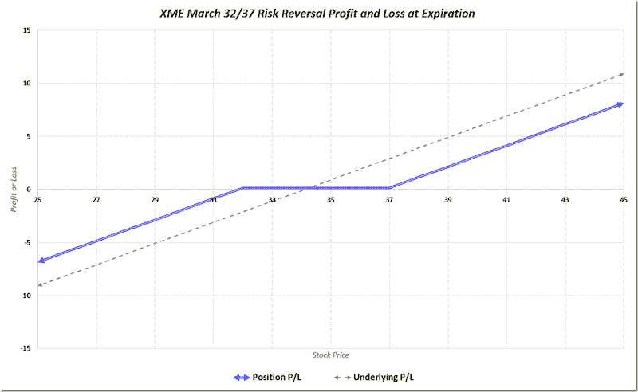

<!--yml

category: 未分类

date: 2024-05-18 16:09:58

-->

# VIX and More: 如何驾驭一头老牛（巴伦周刊特邀专栏作家）

> 来源：[`vixandmore.blogspot.com/2014/11/how-to-ride-aging-bull-guest-columnist.html#0001-01-01`](http://vixandmore.blogspot.com/2014/11/how-to-ride-aging-bull-guest-columnist.html#0001-01-01)

昨天是我第 15 次作为特邀专栏作家为《The Striking Price》撰写文章，而《如何驾驭一头老牛》是我为《巴伦周刊》撰写的少数几篇没有几乎完全专注于 VIX 和波动性的文章之一。

在《巴伦周刊》的文章中我指出，评论家已经称这为“最受憎恨的牛市”大约三年，部分由于对大型牛市的怀疑，许多零售投资者在担心价格过于领先时已经退出了市场。随着股票继续上涨，这些相同的投资者在价格更高时回场的难度也更大。现在，随着 2015 年的临近，许多投资者认为股市可能会继续上涨，他们想知道在认为六年的牛市已经过于漫长的牙齿时，他们可能如何能够利用持续的上涨。

我在《巴伦周刊》文章中讨论的方法之一是寻找表现不佳行业的价值。在文章中我将以能源行业作为标题表现不佳的行业，但指出尽管今年至今能源行业 ETP（[XLE](http://vixandmore.blogspot.com/search/label/XLE)）下跌了 8.5%，但金属和矿业行业 ETP（[XME](http://vixandmore.blogspot.com/search/label/XME)）今年的跌幅为 18.7%。*[不幸的是，由于编辑上的失误，我在 OPEC 会议后提供的更新数字没有被纳入出版物中。]*

[XME 的 33/38 风险反转交易](http://vixandmore.blogspot.com/search/label/risk%20reversal)（做空 33 美元的看跌期权；做多 38 美元的看涨期权）在《巴伦周刊》的文章中被提及，现在 OPEC 决定不削减产量，该交易使用的行权价和价格现在已经相当过时。这种交易的一个更新版本仍然可以产生小幅信用，它使用 32 美元和 37 美元的行权价，利润和损失图表看起来像下面这样。注意，如果 XME 在到期时位于 32 美元到 37 美元之间，这笔交易将产生小幅利润。如果 XME 在到期时低于 32 美元，风险反转（蓝线）的损失将比持有基础资产（虚线灰线）少大约 2.24 美元；如果 XME 在到期时高于 37 美元，风险反转的收益将比持有基础资产少大约 2.76 美元。

（2015 年 3 月 XME 风险反转 112914）](http://lh3.ggpht.com/-9hY2sOwzKcQ/VHvXdFWjLmI/AAAAAAAAJV4/d1NOr0Bd1Qg/s1600-h/XME%252520March%2525202015%252520Risk%252520Reversal%252520112914%25255B5%25255D.png)

来源：[VIXandMore]

虽然金属和采矿行业度过了一个艰难的年份，但中国人民银行最近的降息以及欧洲中央银行预计不久将采取的刺激措施应该会给金属和采矿股票带来提振。其他因素，包括美国经济持续强劲增长，也可能支撑主要专注于美国市场的钢铁、煤炭和铝的 XME。

正如《巴伦周刊》文章中所提到的，人们还可以用 XME 最具流动性的一个组成部分——铝业公司（[AA](http://vixandmore.blogspot.com/search/label/AA)）进行类似的交易，其中 2 月 16/19 日的风险反转具有类似的盈亏潜力，但它触及了 2014 年表现非常强劲的金属和采矿行业的铝。由于铝业公司的期权市场比 XME 更具流动性，这种风险反转的单只股票版本应被视为实现类似敞口的一种替代方式。

相关文章：

我的《巴伦周刊》投稿全文列表：

+   如何在衰老的牛市中骑行（《巴伦周刊》2014 年 11 月 29 日）

+   在“无恐惧”市场中投资者的最佳期权（《巴伦周刊》2014 年 7 月 2 日）

+   低波动性：如何从安静的 VIX 中获利（《巴伦周刊》2014 年 5 月 22 日）

+   新兴市场股票：它们触底了吗（《巴伦周刊》2014 年 3 月 28 日）

+   如何早期识别风险（《巴伦周刊》2013 年 7 月 16 日）

+   如何为你的股票组合投保（《巴伦周刊》2013 年 4 月 18 日）

+   期权交易的理由（《巴伦周刊》2013 年 1 月 2 日）

+   冷静下来，利用他人的焦虑（《巴伦周刊》2012 年 11 月 14 日）

+   如何在波动事件周围交易期权（《巴伦周刊》2012 年 7 月 10 日》）

+   当其他人感到恐惧时贪婪（《巴伦周刊》2012 年 5 月 3 日）

+   将波动性转化为资产类别的几种方式（《巴伦周刊》2011 年 1 月 12 日）

+   [在不确定性中寻找机会](http://online.barrons.com/article/SB50001424052970204743004575622694164710232.html) （2010 年 11 月 18 日）

+   [市场波动性是否会恢复到危机水平？](http://online.barrons.com/article/SB50001424052970204297404575493863568455090.html) （2010 年 9 月 15 日）

+   [预测波动性的风险](http://online.barrons.com/article/SB127430948974994023.html) （2010 年 5 月 20 日）

+   [对波动性采取更长期的视角](http://online.barrons.com/article/SB124648899704482887.html) （2009 年 7 月 2 日）

***披露(s):*** *无*
