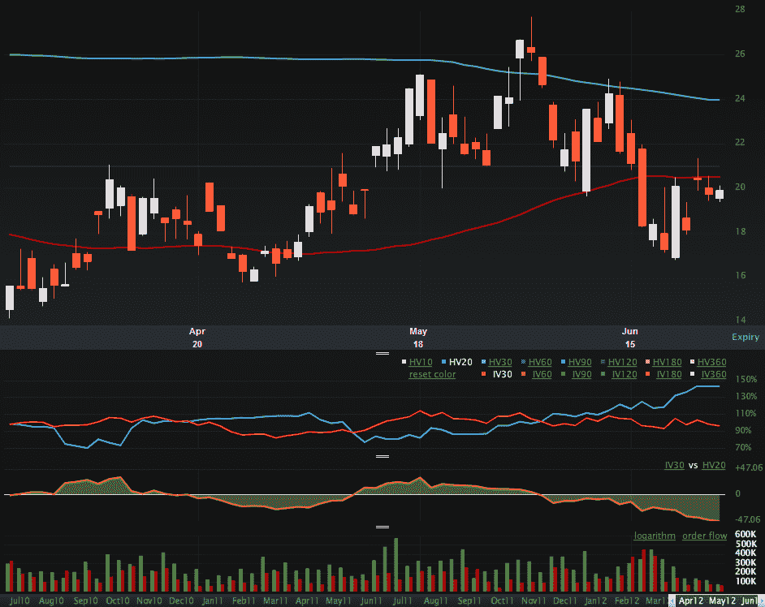

<!--yml

分类：未分类

日期：2024-05-18 16:27:26

-->

# VIX 和更多：VIX IV 与 HV 之间的巨大差距，但方向错误吗？

> 来源：[`vixandmore.blogspot.com/2012/06/huge-gap-between-vix-iv-and-hv-but-is.html#0001-01-01`](http://vixandmore.blogspot.com/2012/06/huge-gap-between-vix-iv-and-hv-but-is.html#0001-01-01)

提出数据和图表，让许多投资者都在猜测是否在欧元区峰会之前风险和不确定性被低估，这并不困难。今天早些时候，我在[欧元波动性和风险](http://vixandmore.blogspot.com/2012/06/euro-volatility-and-risk.html)中提供了一个可能的例子。由于 VIX 在这个领域享有最高声誉（不久前还带有大多数时候只是玩笑的别名，“Your One-Stop VIX-Centric View of the World…”），我认为一个 VIX 特定的例子也可能有趣。

下面的图表显示了 VIX 的最后三个月数据，顶部的 main chart 上是 VIX 实体蜡烛图。从顶部数第二张图表比较了 VIX 的 20 日[历史波动率](http://vixandmore.blogspot.com/search/label/historical%20volatility)(蓝色线条)与 VIX 的 30 日[隐含波动率](http://vixandmore.blogspot.com/search/label/implied%20volatility)(红色线条)，下面的黄色区域图表计算了 HV 减去 IV。让我惊讶的是，当前的 20 日 HV 是 144，而当前的 IV 只有 98。换句话说，市场预计 VIX 在未来一个月内的波动性将*显著减少*，而过去一个月的波动性。我不惊讶看到这个差距，但市场是否正确地判断了差距的方向？在交易机会方面，如果您不同意市场共识，那么 VIX[straddles](http://vixandmore.blogspot.com/search/label/straddle)可能看起来相当便宜。

VIX IV 还提出了一个问题：市场目前的[恐惧](http://vixandmore.blogspot.com/search/label/fear)在哪里？

请注意，CBOE 最近推出了 CBOE VVIX 指数([VVIX](http://vixandmore.blogspot.com/search/label/VVIX)),这实际上是 VIX 的 VIX，与 Livevol 在下面图表中计算的 VIX IV30 衡量非常相似。您可以在 CBOE 的[VVIX 微型网站](http://www.cboe.com/micro/VVIX/)上找到有关 VVIX 的更多信息。我当然有很多话要说关于这个有趣的指数。

相关文章：

**

*[来源(s): LivevolPro.com]*

***披露(s):*** *Livevol 和 CBOE 是 VIX 和 More 的广告商*
