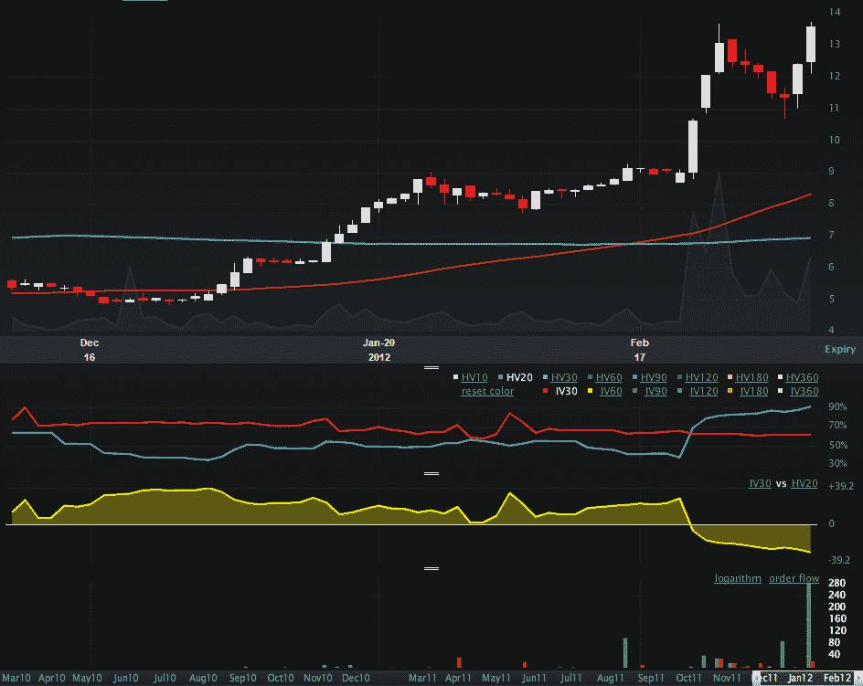

<!--yml

分类：未分类

日期：2024-05-18 16:36:27

-->

# VIX and More: IMOS Breaking Out, But Implied Volatility Fails to React

> 来源：[`vixandmore.blogspot.com/2012/03/imos-breaking-out-but-implied.html#0001-01-01`](http://vixandmore.blogspot.com/2012/03/imos-breaking-out-but-implied.html#0001-01-01)

虽然我通常交易更多的 ETP 而不是单一股票，但我总是关注股票市场上正在发生的事情，特别是在新高方面，因为这有助于我在自下而上的行业分析中的一些思考。最近一只触及我新高雷达的股票是 ChipMOS Technologies (Bermuda) LTD ([IMOS](http://vixandmore.blogspot.com/search/label/IMOS))，该公司为无厂半导体公司、集成设备制造商和代工厂提供全面的半导体测试和封装解决方案。

我发现 IMOS 的一个特别有趣的地方在于，尽管在过去两周内，它在大量交易的情况下创下了新的 52 周高点四次（上图中灰色区域），而历史波动率（蓝色 HV20 线）随着价格的上涨而飙升，但隐含波动率（红色 IV 30 线）似乎对这次大幅的价格变动完全不在乎。

现在 IMOS 期权交易清淡，但尽管如此，这只股票显然正在突破，并从动量交易者那里获得一些关注。坦白说，我不确定为什么隐含波动率没有反应。也许期权交易者确信这种突破会失败，因此认为没有必要调整他们的价格。对我来说更好的赌注是，HV 目前在定价未来股票走势方面做得比 IV 更好，这使得 IMOS 期权非常便宜，即使考虑到合理宽的买卖价差。我的猜测是目前 HV 20 的 91 是一个对未来波动性的更好估计，而不是当前 IV 30 的 62。无论如何，这可能是一个有趣的突破值得关注——甚至可以尝试抛一些期权。

相关文章：

来源：[LivevolPro.com]

***披露(s):*** *在撰写本文时持有 IMOS；Livevol 是 VIX 和 More 的广告商*
