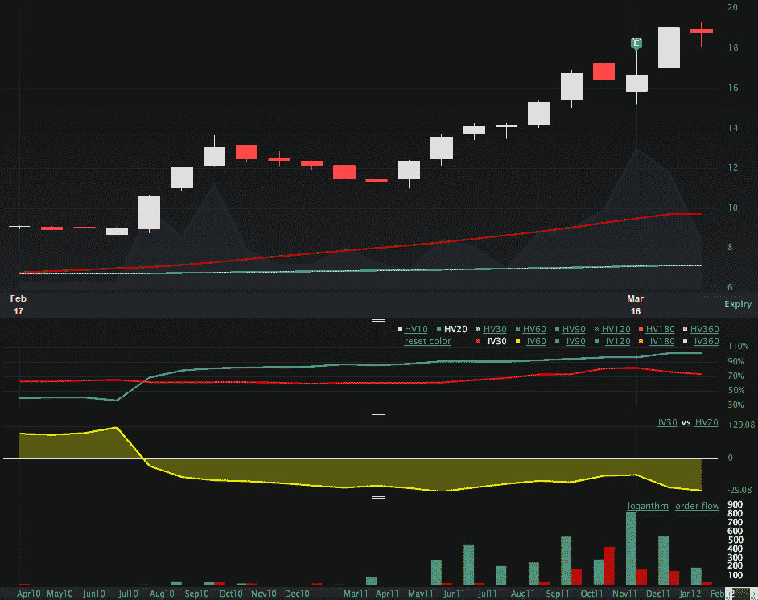

<!--yml

分类：未分类

日期：2024-05-18 16:35:43

-->

# VIX and More: IMOS Up 54% in Two Weeks; IV Still Lags HV

> 来源：[`vixandmore.blogspot.com/2012/03/imos-up-54-in-two-weeks-iv-still-lags.html#0001-01-01`](http://vixandmore.blogspot.com/2012/03/imos-up-54-in-two-weeks-iv-still-lags.html#0001-01-01)

ChipMOS Technologies (Bermuda) LTD ([IMOS](http://vixandmore.blogspot.com/search/label/IMOS)), 在两周内上涨了 54%，自我在[IMOS 突破，但隐含波动率没有反应](http://vixandmore.blogspot.com/2012/03/imos-breaking-out-but-implied.html)一文中提到该股票以来的 12 天内涨幅略低于这个数字。

虽然公司上周五确实报告了收益，但股票似乎没有对这份报告立即做出反应。在周五的交易中，股票波动较大，最终收盘上涨了 1.5%。然而，昨天，它又再次起飞，股票又上涨了 14%。

IMOS 吸引人的一部分是这家基于台湾的公司的公开信息非常有限。因此，该股票对技术因素非常敏感，并且与价格行动有关的情绪成分也很高。

上次我发帖谈 IMOS 主要是因为我觉得一个在财报前突破的股票具有如此低的[隐含波动率](http://vixandmore.blogspot.com/search/label/implied%20volatility)（红线 30 日 IV）是一件有趣的事情，尽管 IMOS 现在显然“在交易中”至少在一些投资者的脑海中。我当时评论说“当前 HV 20 的 91 是一个比当前 IV 30 的 62 更好的未来波动率估计。”

大约两周后，发生了一些有趣的事情。如下面的一个月图表所示，即使考虑到财报公布后股价下跌 10%，IV 30 也已升至 75。现在历史波动率（蓝线 HV20）为 102，隐含波动率仍然是对 IMOS 未来潜在走势的保守估计，特别是当考虑到现在日交易量大约是过去三个月平均水平的五倍时。

期权成交量也有了显著增长，几乎所有动作都在看涨期权方面。

在交易方面，这是我通常不喜欢介入的类型的货运列车，但是在我平仓了我的多头头寸后，我发现有一些定义明确的风险交易在空头方面有一些潜力。

相关文章：

*[来源(s): LivevolPro.com]*

***披露(s):*** *在撰写本文时做空 IMOS；Livevol 是 VIX and More 的广告商*
