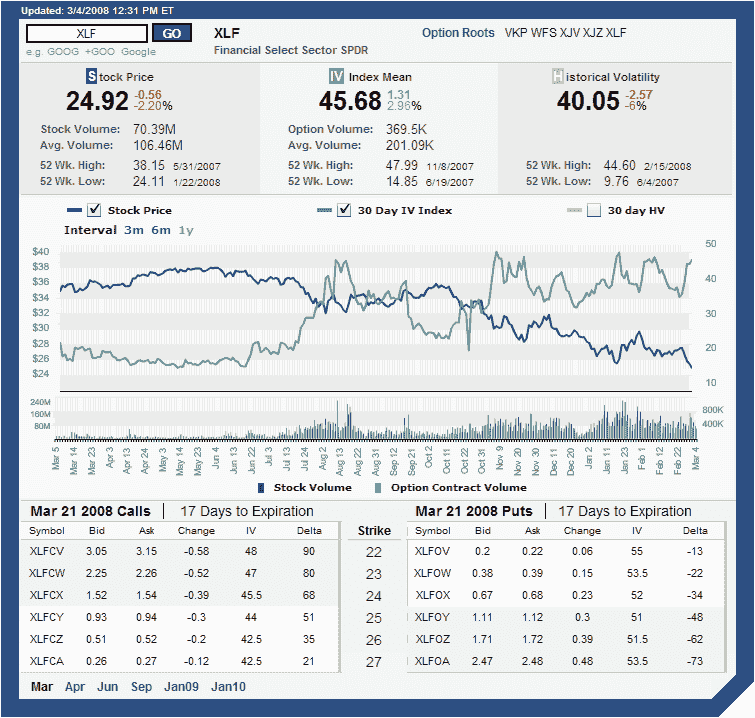

<!--yml

类别：未分类

日期：2024-05-18 18:41:36

-->

# VIX 和更多：ISE 隐含波动率图表

> 来源：[`vixandmore.blogspot.com/2008/03/ise-implied-volatility-charts.html#0001-01-01`](http://vixandmore.blogspot.com/2008/03/ise-implied-volatility-charts.html#0001-01-01)

说到[隐含波动率](http://vixandmore.blogspot.com/search/label/implied%20volatility)图表，我通常使用两家我最喜欢的期权经纪商提供的图表：[thinkorswim](http://www.thinkorswim.com/)和[optionsXpress](http://optionsxpress.com/)。另一方面，这个博客上到处都是来自[iVolatility.com](http://www.ivolatility.com/)的 IV 图表，这主要是因为这些图表在网上是免费提供的，而且它们的界面相对干净、无杂乱。

为了视觉上的变化，我怀疑我很快就会开始发布一些优秀的 thinkorswim 图表，但对于那些希望亲自制作的人来说，我想强烈推荐国际证券交易所发布的[隐含波动率图表](http://vixandmore.blogspot.com/search/label/ISE)。在 ISE 网站上的[ISEE](http://vixandmore.blogspot.com/search/label/ISEE)图表，我经常对糟糕的图形感到沮丧，但 ISE 个别证券的图表却很出色。下面就是 ISE 波动率图表的一个例子，我包括了[XLF](http://vixandmore.blogspot.com/search/label/XLF)的图表。这些图表可以自定义为 3 个月、6 个月或 12 个月的时间框架，并通过复选框允许用户指定任何股票价格、隐含波动率以及 30 天历史波动率（我在这里关闭了历史波动率。）正如您从下面的图表中看到的，这些图表中包含了很多信息，包括每日股票和期权成交量（在较短的时间框架中更容易阅读），以及大量的波动率数据。所有数据都延迟 20 分钟，但就我而言，这些是最优秀的免费波动率图表。

要在 ISR 生成你自己的波动率图表，试试他们的[报价/波动率页面](http://www.ise.com/WebForm/md_livevol.aspx?categoryId=124&header3=true&menu1=true)。

[来源：国际证券交易所]
