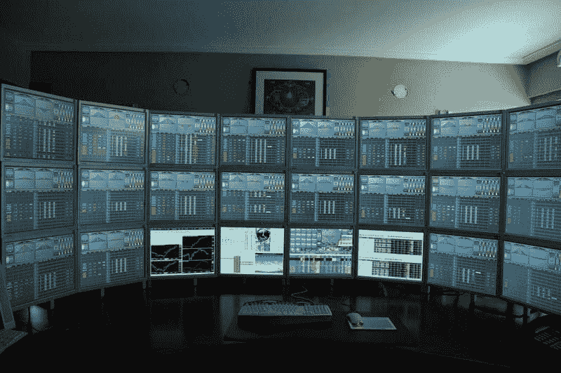

<!--yml

类别：未分类

日期：2024-05-18 18:59:58

-->

# VIX 和更多：ISEE 买入信号即将到来，但这交易可行吗？

> 来源：[`vixandmore.blogspot.com/2007/09/isee-buy-signal-coming-but-is-it.html#0001-01-01`](http://vixandmore.blogspot.com/2007/09/isee-buy-signal-coming-but-is-it.html#0001-01-01)

更新先前的帖子，现在看起来我两周前预期的九月份 ISEE 买入信号最早可能在周五到来。

我相信全世界的交易者都兴奋不已，焦急地数着分钟直到 ISEE 告诉他们冲进市场。但认真说，这种虚假的炒作值得这么费劲吗？

就在回答这个问题的时候，MarketSci.com 的 Michael Stokes 在今天发布的三部曲研究中查看了[总看跌/看涨比率](http://stockcharts.com/charts/gallery.html?%24cpc)作为一个定时工具。简而言之，MarketSci 得出结论，尽管总看跌/看涨比率[有一些可预测的模式](http://marketsci.com/studies/20070907.02.html)，但将这种知识转化为一个获胜的交易系统并非易事。最后，他们发现看跌/看涨数据可以成功地用来[至少增强一个 SPX 交叉系统](http://marketsci.com/studies/20070907.03.html)。

有一点评论是合适的。

首先，说到看涨看跌比率，我更偏好 ISEE（美国期权交易者协会）的比率，因为它只计算开盘期权购买量。我的第二选择会是 CBOE（芝加哥期权交易所）的[股指看跌/看涨比率](http://vixandmore.blogspot.com/search?q=cpce)。第三和第四选择则是总看跌/看涨比率（这个比率将股指和股市的看跌/看涨数据相加，并在 MarketSci 的研究中使用）和股指看跌/看涨比率。理论上是说个人投资者更可能交易个别股票期权，而大型机构则会在股指期权上有不成比例的参与。（注意，ISEE 最近开始单独列出只计算股票的比率，但由于数据回溯不久，我还没有开始使用。）

第二，看跌/看涨比率是一个很好的工具。波动率指标如 VIX 也是。同时关注这两个指标总是有意义的，正如我之前谈到[PCVXO](http://vixandmore.blogspot.com/search/label/PCVXO)和这个指标的我自己版本，我将其命名为[PCEVXO](http://vixandmore.blogspot.com/search/label/PCEVXO)。

第三，我[最近回顾了](http://vixandmore.blogspot.com/2007/05/cxo-advisory-group-on-cboe-put-to-call.html) [CXO 集团](http://www.cxoadvisory.com/) 对 [ISEE](http://www.cxoadvisory.com/blog/internal/blog5-09-07/) 和 [CBOE 总看跌/看涨比率](http://www.cxoadvisory.com/blog/internal/blog5-08-07/) 的分析。你可以通过上一句话中的链接阅读他们的原始分析，但结论是他们对这两个工具都不是特别看好，尤其是总看跌/看涨比率。

第四，有诸多书籍对看跌/看涨比率进行了深入的阐述；我这里只提及三本。伯尼·谢弗（Bernie Schaeffer）在其著作《技术分析的新思维》（[New Thinking in Technical Analysis](http://www.amazon.com/New-Thinking-Technical-Analysis-Trading/dp/1576600491/ref=pd_bbs_sr_1/103-0088821-7291048?ie=UTF8&s=books&qid=1175375233&sr=1-1)）中分享了他关于看跌/看涨比率的一些思考；拉里·康纳斯（Larry Connors）和康纳·森（Connor Sen）在《市场是如何运作的》（[How Markets Really Work](http://www.amazon.com/How-Markets-Really-Work-Quantitative/dp/0975551310)）一书中进行了出色的统计分析；加里·史密斯（Gary Smith）在其著作《我是如何谋生的》（[How I Trade for a Living](http://www.amazon.com/Trade-Living-Wiley-Online-Trading/dp/0471355143)）中阐述了他的思考，并推荐了他自己的某些模型。

所以……读书、分析、测试。答案就在那里。周五时最好把买按钮准备好，以防万一。
