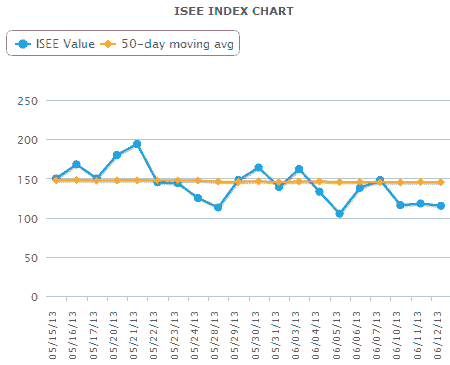

<!--yml

分类：未分类

日期：2024-05-18 16:16:06

-->

# VIX and More: ISEE Equities Only Index Prints Something Not Seen Since March 6, 2009

> 来源：[`vixandmore.blogspot.com/2013/06/isee-equities-only-index-prints.html#0001-01-01`](http://vixandmore.blogspot.com/2013/06/isee-equities-only-index-prints.html#0001-01-01)

**看涨期权与看跌期权比率**（http://vixandmore.blogspot.com/search/label/put%20to%20call）是我指标库中的一个固定元素，也是我多年来一直在撰写的内容，包括 2007 年初的一个早期作品，《**情绪入门（长）**》（http://vixandmore.blogspot.com/2007/03/sentiment-primer-long.html）。

在我所有现成的看涨期权与看跌期权的比率中，我最喜欢的一个实际上反转了传统比率：**ISEE**股票仅**看涨期权与看跌期权**比率。这个比率只计算期权购买的 opening，并排除指数和 ETF 产品，以便更精确地预测零售投资者青睐的投机交易类型。

昨天引起我注意的是，在审查我的专有综合市场情绪指标（**AMSI**）（http://vixandmore.blogspot.com/search/label/AMSI）的**新闻通讯**（http://vixandmoresubscriber.blogspot.com/）组成部分时，我发现 ISEE 股票仅看涨期权与看跌期权比率已连续三天收盘低于 120（意味着每 100 个开盘看跌购买中，开盘看涨购买少于 120 个），这是自 2009 年 3 月 6 日以来第一次——那一天 SPX 在 666 点触底，开始了持续至今超过四年的牛市行情。不出所料，这种帽子戏法通常与股市极度超卖并准备好反弹的条件有关，正如今天似乎是这样，2009 年 3 月肯定也是这样。

记录显示，今天 ISEE 股票看涨期权与看跌期权的比率回到了其传统区间的 middle，最近为 178，随着金融市场发现某种正常状态——至少在日本日元之外。

下面的图表显示了 ISEE 股票仅看涨期权与看跌期权比率，使用过去一个月的收盘值，截至昨天的收盘。

请注意，ISEE 比率还有另外两种形式：一种仅限于指数和 ETF 交易的指数；以及一个所有证券指数，结合了仅股票数据和指数+ETF 数据。当前和历史数据以及所有三种 ISEE 看涨期权与看跌期权比率的互动图表，可在**ISEE 指数页面**（http://www.ise.com/market-data/isee-index/）获得。

对于那些可能对看涨期权与看跌期权比率有更多了解兴趣的人，我在下面提供了一个比平常更大的链接列表，以启动你的研究。

**来源（s）：国际证券交易所**

相关文章：

****披露（s）：**** *无*
