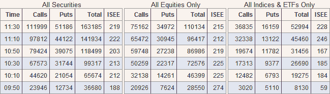

<!--yml

类别：未分类

日期：2024-05-18 18:08:47

-->

# VIX and More: ISEE Equity Call to Put Ratio at Highest Level in 16 Weeks

> 来源：[`vixandmore.blogspot.com/2008/12/isee-equity-call-to-put-ratio-at.html#0001-01-01`](http://vixandmore.blogspot.com/2008/12/isee-equity-call-to-put-ratio-at.html#0001-01-01)

股指看涨期权与看跌期权的比率在周五达到了 16 周新高 189，因为投资者明显偏爱看涨期权胜过看跌期权。今天这个比率更高，截至东部时间上午 11:30，达到了 215。

目前交易量清淡，ISEE 的极端值随着白天的推移有回归平均值（146）的倾向，但是紧接着周五的高数字，我认为全天都应该关注 ISEE 的数字。

记录显示，上一次 ISEE 股指看涨期权与看跌期权的比率在一次交易中超过 200 是在五月中旬。当时，市场正处于三月份顶部的形成过程中。

*[source: International Securities Exchange]*
