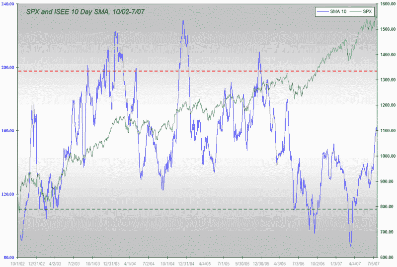
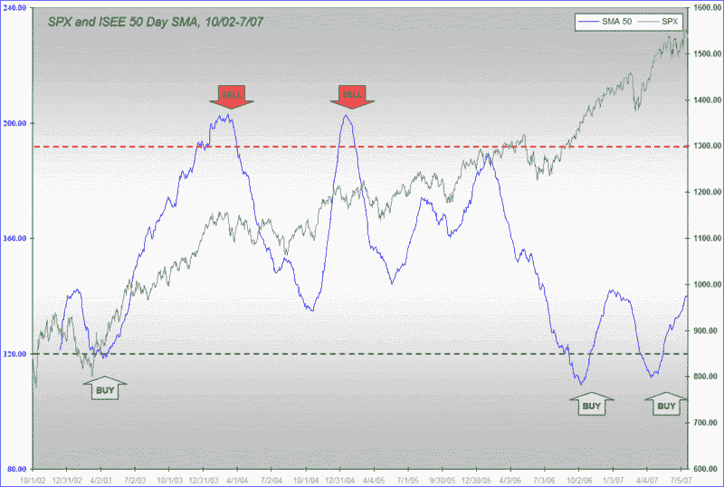

<!--yml

category: 未分类

date: 2024-05-18 19:06:12

-->

# VIX 和更多：ISEE 更新

> 来源：[`vixandmore.blogspot.com/2007/07/isee-update.html#0001-01-01`](http://vixandmore.blogspot.com/2007/07/isee-update.html#0001-01-01)

我最近没有太多谈论[ISEE](http://vixandmore.blogspot.com/search/label/ISEE)，主要因为它没有给我太多提示。在我的上一个通话中，4 月 23 日，我[预测 ISEE 的 50 天 SMA 将形成双底](http://vixandmore.blogspot.com/2007/04/isee-sma-50-double-bottom.html)，结果证明完全正确，如果你在过去三个月里持有市场，你可能做得很好。

今天，Babak 在[交易者的叙述](http://www.tradersnarrative.com/)中[预测市场将出现动荡](http://www.tradersnarrative.com/ise-sentiment-turbulence-ahead-for-the-market-1179.html)，称由于 ISEE 的 10 天 SMA 的激增，“在接下来的几天和几周内，市场可能正走向某种短期顶点或波动性交易。” 他还提供了一张[出色的图表](http://www.tradersnarrative.com/wp-content/uploads/2007/07/ise%20sentiment%20july%202007.png)来支持这一预测。

虽然 Babak 一直是我[最喜欢的博主](http://vixandmore.blogspot.com/search?q=Babak)，但我不得不与他预测的相反。首先，我提供了自己的 ISEE 10 天 SMA 图表，连同 SPX，回溯到 ISEE 的诞生，大约五年前。如图所示，当前的 ISEE 10 天 SMA 水平几乎处于 5 年区间的中心，200 左右的读数更适合于判断市场顶点而非当前的 157。

我偏好的 ISEE SMA，50 天变体，仍然显示出相对较低的看涨活动水平（记住 ISEE 是看涨/看跌比率，而非更常见的倒数）一直追溯到去年夏天的修正。如图所示，4 月的买入信号仍然有效，在可预见的未来看起来并不受威胁，尽管 ISEE 读数近来明显走高。

至于一直让我担忧的看跌/看涨比率，是 CBOE 的股票看跌/看涨比率，但由于我通常优先考虑 ISEE 而非 CBOE 的股票比率，目前我的担忧相对减轻。
