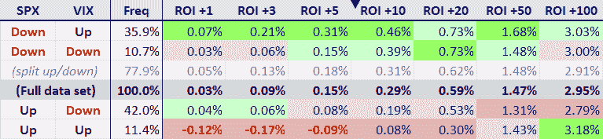

<!--yml

category: 未分类

date: 2024-05-18 16:40:43

-->

# VIX 和更多：SPX 和 VIX 正相关的含义

> 来源：[`vixandmore.blogspot.com/2012/02/implications-of-positively-correlated.html#0001-01-01`](http://vixandmore.blogspot.com/2012/02/implications-of-positively-correlated.html#0001-01-01)

对于那些错过今天市场动作，只是看了死后报告的人来说，今天可能看起来只是系列无事件日中的又一个。对于那些关注 VIX 期货（[点击查看相关内容](http://vixandmore.blogspot.com/search/label/VIX%20futures)）和基于 VIX 期货的 ETP，如[TVIX](http://vixandmore.blogspot.com/search/label/TVIX) (+10.7%)和[VXX](http://vixandmore.blogspot.com/search/label/VXX) (+5.2%)的人，而言，空气中的紧张气氛是显而易见的。

但是，SPX、道琼斯工业平均指数和纳斯达克综合指数今天全线上涨，这有什么大不了的？结果证明，如果 VIX (+2.6%)和 SPX (+0.1%)同时朝同一个方向移动，投资者很容易惊慌。如下图所示，VIX 和 SPX 在约 22%的交易日里会朝同一个方向移动。我认为投资者对 VIX 和 SPX 方向的关注背后，与我在昨天提出的假设有关：[VIX 厨房水槽图的含义](http://vixandmore.blogspot.com/2012/02/what-vix-kitchen-sink-chart-says.html)：

> *“…普遍共识似乎是，股票根本不配他们当前的高估值。在这种环境下，许多投资者变得特别容易受到[确认偏差](http://vixandmore.blogspot.com/search/label/confirmation%20bias)的影响，并急于寻找一个或多个指标，这些指标会告诉他们他们已经开始相信的事情：即大调整可能就在拐角处。”*

上一次我计算[VIX 和 SPX 日度相关性](http://vixandmore.blogspot.com/search/label/SPX-VIX%20correlation)的数据，是在 2007 年 5 月。在查看了 1990-2007 年的数据后，我得出结论：VIX 和 SPX 之间的高正相关性往往预示着市场疲软。[点击此处查看详细文章](http://vixandmore.blogspot.com/2007/05/high-positive-correlation-between-vix.html)。这次再次运行这些数字，发现 2008 年金融危机以及随后的牛市反弹对整体结论影响不大。现在完整的数据集（1990-2012）显示，当 VIX 和 SPX 在同一天上涨时，接下来 1-100 个交易日的平均回报显著低于整个数据集的平均回报，而且在头五个交易日内为负。

在关键要点方面，现在看来，股票在 SPX 下跌而 VIX 上涨的日子表现最佳（ROI +1 列指的是 SPX 隔日表现），而在 SPX 和 VIX 都上涨的日子表现最差，比如今天。我已经按照 ROI +10 对行进行排序，从日期来看，很明显，一些[均值回归](http://vixandmore.blogspot.com/search/label/mean%20reversion)是导致各种 VIX-SPX 每日回报排列表现特征的主要原因。 *[记录在案，下表中的数据包括周五和周一，因此可能存在[日历回归](http://vixandmore.blogspot.com/search/label/calendar%20reversion)对结果产生影响的情况。]*

现在我首先要承认，股市确实需要回调，但是仅仅因为 VIX 和 SPX 连续两天上涨，并不意味着行星正在对齐，为水瓶座（[Aquarian](http://en.wikipedia.org/wiki/Age_of_Aquarius)）的抛售做好准备。如果投资者正在寻找市场反转的银弹，那么虽然 SPX-VIX 相关性数据悲观，但不足以暗示重大反转。

下面是一组比平常更大的链接，供那些可能想深入了解本空间中 SPX-VIX 相关主题历史的人使用。

最后但并非最不重要的是，感谢敏锐的读者李，他的侦查帮助我发现了一个错误的电子表格公式，导致本文早期版本中出现了一些错误数据。

相关文章：

*[来源(s): CBOE, Yahoo]*

***披露(s):*** *在撰写本文时做空 TVIX 和 VXX*
