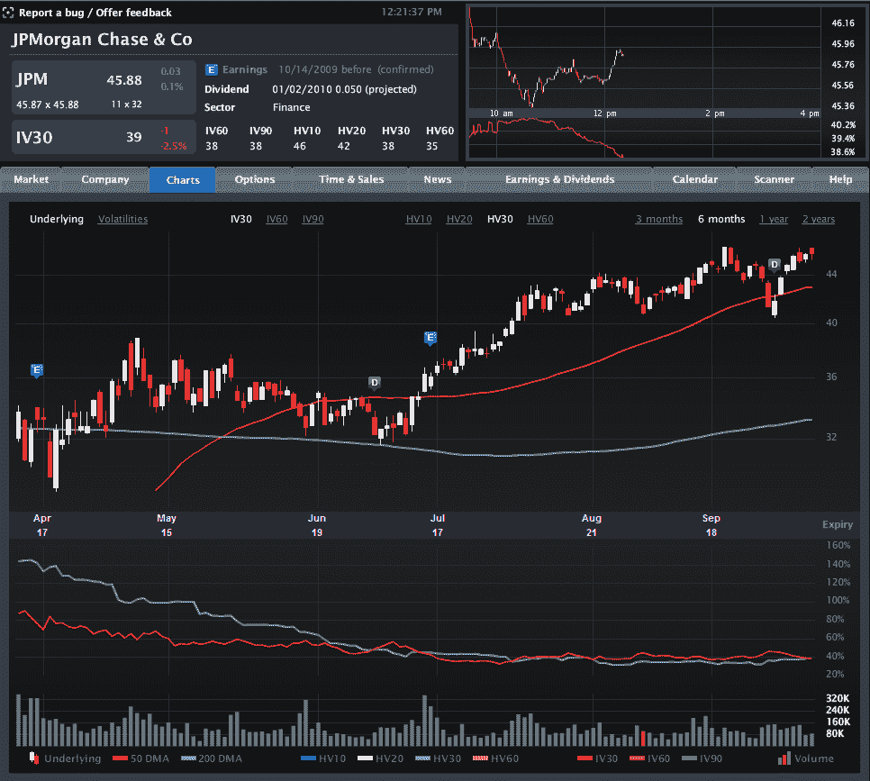

<!--yml

分类：未分类

日期：2024-05-18 17:26:47

-->

# VIX 和更多：银行财报前隐含波动性平稳

> 来源：[`vixandmore.blogspot.com/2009/10/implied-volatility-flat-ahead-of-bank.html#0001-01-01`](http://vixandmore.blogspot.com/2009/10/implied-volatility-flat-ahead-of-bank.html#0001-01-01)

随着本周金融板块一些非常重要的财报即将发布（摩根大通[JPM](http://vixandmore.blogspot.com/search/label/JPM)周三发布；[C](http://vixandmore.blogspot.com/search/label/C)和[GS](http://vixandmore.blogspot.com/search/label/GS)周四发布；[BAC](http://vixandmore.blogspot.com/search/label/BAC)和[GE](http://vixandmore.blogspot.com/search/label/GE)周五发布），我一直密切关注该板块的隐含波动性（IV）。令我惊讶的是，在财报发布前，隐含波动性并没有像通常那样增加。

下图为[Livevol](http://www.livevol.com/)提供的图表，展示了摩根大通（JPM）过去六个月的股价和波动性活动，图表上半部分突出了过去两次财报发布，用蓝色“E”图标表示。图表下半部分在同一时期内绘制了 30 天隐含波动性（红线）与 30 天历史波动性（浅蓝线）的对比。

请注意，在最近两次财报发布之前，由于财报惊喜的不确定性和潜在的高波动性，隐含波动性有所上升。然而，此次财报季，隐含波动性的缺乏变动——以及隐含波动水平接近历史波动性——表明投资者根本不期待任何惊喜。事实上，这种情况不仅限于摩根大通，花旗集团、美国银行、高盛甚至准金融的通用电气也反映了这种情况。毫不奇怪，银行 ETF（如[KBE](http://vixandmore.blogspot.com/search/label/KBE)）和金融板块 ETF（如[XLF](http://vixandmore.blogspot.com/search/label/XLF)）显示出类似的模式。

无论当前的财报季如何展开，都很难想象不会有任何惊喜。那些认为隐含波动性低估了银行惊喜潜力的投资者可能会考虑启动长期[横摆](http://vixandmore.blogspot.com/search/label/straddle)或长期[勒紧](http://vixandmore.blogspot.com/search/label/strangle)策略，以利用潜在的隐含波动性增加——从而提高期权价格。

对于一些关于金融领域隐含波动性的相关文章，读者们可以查阅以下内容：

*[来源：Livevol Pro]*
