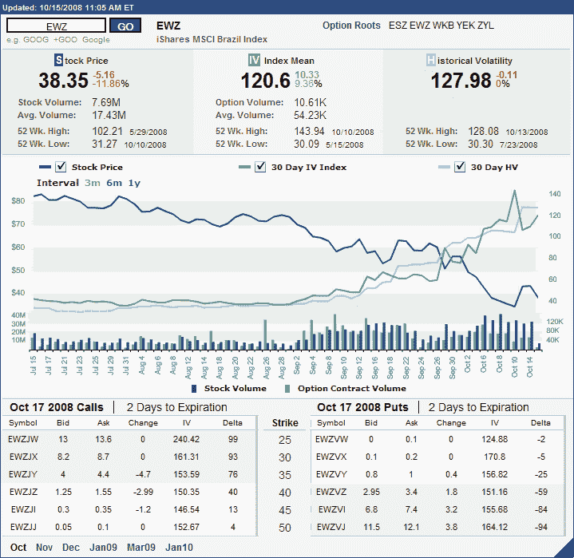

<!--yml

分类：未分类

日期：2024-05-18 18:21:15

-->

# VIX and More: Implied Volatility Over 150 in EWZ, the Brazil ETF

> 来源：[`vixandmore.blogspot.com/2008/10/implied-volatility-over-150-in-ewz.html#0001-01-01`](http://vixandmore.blogspot.com/2008/10/implied-volatility-over-150-in-ewz.html#0001-01-01)

事实上，我可以随机挑选一个股票代码，并有一个令人信服的隐含波动率图表。有些图表当然比其他的更有说服力。

例如，看看[EWZ](http://vixandmore.blogspot.com/search/label/EWZ)，这个[巴西](http://vixandmore.blogspot.com/search/label/Brazil)的 ETF。这个资源丰富的国家在过去一年里看到它的 ETF 价值缩水超过一半，同时在过去一个月里波动性急剧上升。

下方的图表，由[国际证券交易所](http://ise.com/)提供，可以发现即使 ETF 在夏季趋势下跌，[隐含波动率](http://vixandmore.blogspot.com/search/label/implied%20volatility)和[历史波动率](http://vixandmore.blogspot.com/search/label/historical%20volatility)也一直在 40 左右的范围内波动。从九月初开始，ETF 和期权的交易量增加暗示着一场更加剧烈的波动即将到来。

实际上，隐含波动率从 40 跃升至超过 140，历史波动率也取得了类似的涨幅。此刻，两者平均隐含波动率和历史波动率都超过了 120，接近到期日的价内看涨期权和看跌期权的隐含波动率读数超过 150。这是国家风险在极端水平。

那些有方向性偏好，希望在高波动性环境中限制风险的交易者可能会想看看[熊市看涨期权价差](http://vixandmore.blogspot.com/search/label/bear%20call%20spread)用于短期偏向[和牛市看跌期权价差](http://www.optionsxpress.com/educate/strategies/bullputspread.aspx)用于长期偏向。

来源：[国际证券交易所]

*[披露：撰写本文时持有 EWZ]*
