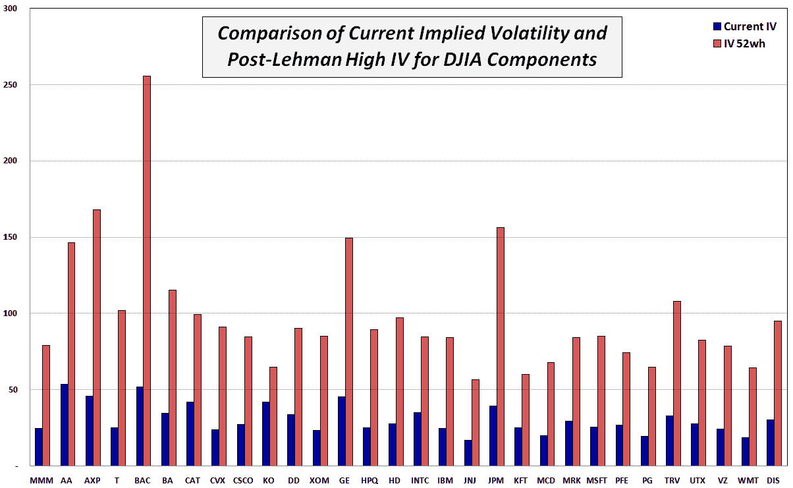

<!--yml

category: 未分类

date: 2024-05-18 17:30:02

-->

# VIX and More: 道琼斯工业平均指数成分股的隐含波动率：现在与 52 周高点对比

> 来源：[`vixandmore.blogspot.com/2009/09/implied-volatility-for-djia-components.html#0001-01-01`](http://vixandmore.blogspot.com/2009/09/implied-volatility-for-djia-components.html#0001-01-01)

随着雷曼兄弟破产一周年的到来，我想象中庆祝的派对会非常少。

我当然没有庆祝我第二次跳伞的经验，但我确实想确保在那段时间的一些波动数据在这里为后世保存。在未来的某个时刻，我们中的某些人将想要回顾并看看在 10 月和 11 月的历史波动期间事情变得多么疯狂。

带着这样的想法，我选择让这周的[图表](http://vixandmore.blogspot.com/search/label/chart%20of%20the%20week)反映出当前[隐含波动率](http://vixandmore.blogspot.com/search/label/implied%20volatility)与道琼斯工业平均指数 30 家成分公司的 52 周高点隐含波动率的对比。当然，道琼斯工业平均指数由世界上一些最稳健的公司组成，因此这个练习应该突出一些公司因金融危机的影响比他们的某些投机性同行更为轻微。事实上，这些蓝筹股的峰值隐含波动率平均比现在高出约 3.2 倍。即使现在，其中的一些数字也令人震惊，使得 89.53 的 VIX 看起来几乎平淡无奇。

请注意，当雷曼兄弟破产时，花旗集团（[C](http://vixandmore.blogspot.com/search/label/C)）和[AIG](http://vixandmore.blogspot.com/search/label/AIG)是道琼斯工业平均指数的组成部分，随后它们从这个精选俱乐部的会员资格被取消。为了进行比较，考虑花旗集团的隐含波动率最高达到 328 以上，目前为 66。另一方面，AIG 的隐含波动率一度激增至 540。自那时以来，它已经下降到更加温和但相当 elevated 135。进步？也许…

来源：[国际证券交易所]
