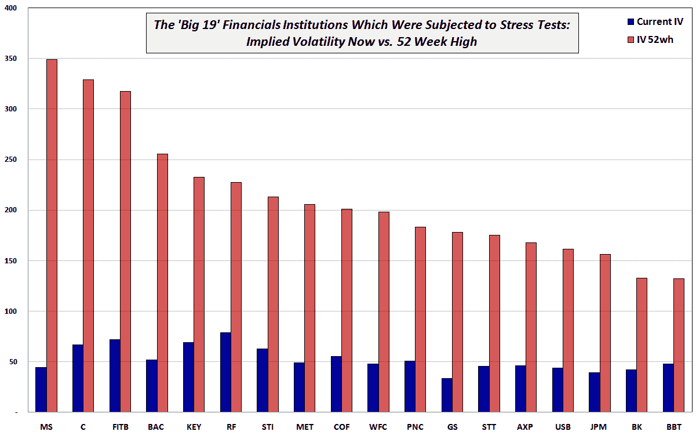

<!--yml

分类：未分类

日期：2024-05-18 17:29:41

-->

# VIX and More: 19 家大型金融机构的隐含波动率：现在与 52 周最高值

> 来源：[`vixandmore.blogspot.com/2009/09/implied-volatility-of-19-large.html#0001-01-01`](http://vixandmore.blogspot.com/2009/09/implied-volatility-of-19-large.html#0001-01-01)

上周日[的图表](http://vixandmore.blogspot.com/search/label/chart%20of%20the%20week)，查看了[道琼斯工业平均指数成分股的隐含波动率：现在与 52 周最高值](http://vixandmore.blogspot.com/2009/09/implied-volatility-for-djia-components.html)，引起了足够的关注，需要跟进一个查看 19 家接受政府压力测试的金融机构当前的隐含波动率（IV）与 52 周最高 IV 的比较。 *[压力测试结果的链接](http://www.federalreserve.gov/newsevents/press/bcreg/bcreg20090507a1.pdf)*

下面的图表将金融机构按照从左到右的 52 周隐含波动率最高值进行排序，其中排除了通用汽车（GM）。虽然图表中没有体现，但我发现当前隐含波动率（IV）最低的与最高 IV 相比的两大机构是摩根士丹利（[MS](http://vixandmore.blogspot.com/search/label/MS)）仅为 52 周最高值的 12.7%，和高盛（[GS](http://vixandmore.blogspot.com/search/label/GS)）为 52 周最高值的 18.9%。那些当前 IV 与 52 周最高值（按百分比计算）最接近的机构是 BB&T（[BBT](http://vixandmore.blogspot.com/search/label/BBT)）的 36.3%和 Regions Financial（[RF](http://vixandmore.blogspot.com/search/label/RF)）的 34.6%。

所以……仅从隐含波动率最高值的百分比回撤来看，投资银行似乎最为健康并且去风险最多，而区域银行则经历了一个更为审慎的康复过程——这大致符合预期。显然，这是多条不同路径回归金融健康的故事。

来源：[国际证券交易所]
