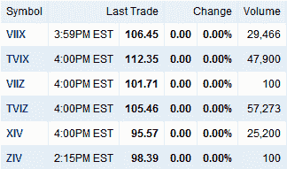

<!--yml

类别：未分类

日期：2024-05-18 16:57:34

-->

# VIX 和更多：VelocityShares 推出的新波动率 ETN 表现出色

> 来源：[`vixandmore.blogspot.com/2010/11/impressive-launch-for-sextet-of-new.html#0001-01-01`](http://vixandmore.blogspot.com/2010/11/impressive-launch-for-sextet-of-new.html#0001-01-01)

今天可交易的 VIX ETN 数量翻了一番多，这是因为 VelocityShares 成功推出了六只新的 ETN。

在[VelocityShares 进入 VIX ETP 领域推出杠杆和反向产品](http://vixandmore.blogspot.com/2010/11/velocityshares-jumping-in-to-vix-etp.html)的一周前，我将在 VIX 基础 ETP 领域的现有和宣布的竞争产品与新的 VelocityShares ETN 进行了比较。

今天这些新产品的交易中，有几件事情让我印象深刻。首先，六只 ETN 今天总共交易了大约 16 万股，这是一个出色的表现，表明对波动性产品的需求强劲，尤其是在围绕[欧洲主权债务危机](http://vixandmore.blogspot.com/search/label/European%20sovereign%20debt%20crisis)的不确定性如此之多的情况下。其次，我感兴趣的是最活跃的产品是两只杠杆 ETN。令我惊讶的是[TVIZ](http://vixandmore.blogspot.com/search/label/TVIZ)，它使用+2x 杠杆应用于五个月的目标到期，成为成交量最大的（57,273 股），略超过[TVIX](http://vixandmore.blogspot.com/search/label/TVIX)，它将+2x 杠杆应用于一个月的目标到期。就开盘日成交量而言，下一个有趣层次的是+1x([VIIX](http://vixandmore.blogspot.com/search/label/VIIX))和-1x([XIV](http://vixandmore.blogspot.com/search/label/XIV))一个月的 ETN，与现有的 Barclays 产品重叠。最后，只有 100 股在+1x([VIIZ](http://vixandmore.blogspot.com/search/label/VIIZ))和-1x([ZIV](http://vixandmore.blogspot.com/search/label/ZIV))产品中交易，这些产品的目标到期为五个月。因此，基于只有一天的数据就大胆得出结论，投资者对新的 VIX 基础 ETN 的兴趣似乎最大的是杠杆产品，然后是一个月的到期，五个月的到期则排在最后。

当然，我预计 sophisticated investors 将根据 [VIX futures](http://vixandmore.blogspot.com/search/label/VIX%20futures) [term structure](http://vixandmore.blogspot.com/search/label/term%20structure) 的形状调整他们的策略。今天，最接近的 VIX 期货收盘价比第二个月的 VIX 期货低 2.60 点。另一方面，第五个月的 VIX 期货收盘价仅比第六个月的 VIX 期货低 0.15 点。为了完成每日波动率图片，今天最接近的月份和第二个月的 VIX 期货的上涨速度大约是第五个月和六个月 VIX 期货的两倍。

我看到了许多机会，甚至考虑在可预见的未来只交易基于 VIX 的 ETP。

相关文章：

*[图片: Yahoo.com]*

***披露(s):*** *无*
