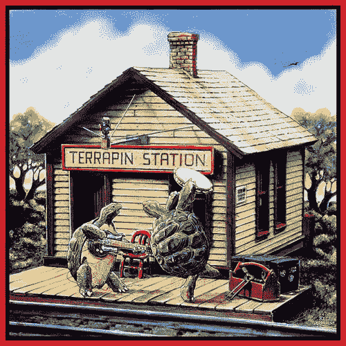

<!--yml

类别：未分类

日期：2024-05-18 18:44:15

-->

# VIX 和更多：指数波动和成分股相关性

> 来源：[`vixandmore.blogspot.com/2008/02/index-volatility-and-component.html#0001-01-01`](http://vixandmore.blogspot.com/2008/02/index-volatility-and-component.html#0001-01-01)

当我在今早香甜地睡觉时，Adam 在[每日期权报告](http://adamsoptions.blogspot.com/2008/02/correlation-station.html)已经起床并在分解标普 500 指数的波动性。 引用[Bespoke 投资集团](http://bespokeinvest.typepad.com/)汇编的数据，该数据显示过去六个月中[标普 500 板块](http://vixandmore.blogspot.com/search/label/SPDRs)之间的[相关性增加](http://bespokeinvest.typepad.com/bespoke/2008/02/correlation-tic.html)，Adam 得出结论，当前高水平的[指数波动](http://www.cboe.com/micro/volatility/introduction.aspx)（VIX，VXN，RVX，VXO，VXD）部分是由于标普 500 成分股之间的最近相关性增加。

在[相关性车站](http://adamsoptions.blogspot.com/2008/02/correlation-station.html)（与[Terrapin Station](http://en.wikipedia.org/wiki/Terrapin_Station)无关）中，Adam 如下分解：

*“你可以把指数波动归结为两个基本因素。一个是组成股票的波动性，另一个是这些股票之间的相关性。它们可以很大程度上互相抵消。想象一个世界，其中一半的股票在剧烈地移动，基本上趋势朝一个方向，而另一半则以同样的方式移动。指数波动将会非常低，因为这些移动将会互相抵消。

现在的情况正好相反。股票并不是那么宇宙级的波动，但它们都在相对一致地移动。因此，理论上指数波动相对于个股波动是*高的*。”*

我已经无法对那个解释做太多改进。

虽然理解相关性现象很重要，但我相信许多人都在想知道当前的情况是否可以交易。 对于微不足道的价值，我不会采取应该在相关性开始解体时赢利的交易，但我鼓励对这个主题感兴趣的人（另一种类型的[均值回归](http://vixandmore.blogspot.com/search/label/mean%20reversion)玩法）去查看 Adam 关于一些[可能交易](http://adamsoptions.blogspot.com/2008/02/correlation-station.html)的思考。
