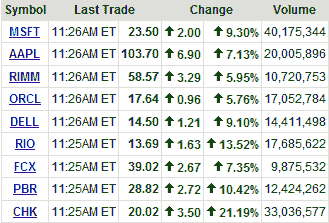

<!--yml

类别：未分类

date: 2024-05-18 18:21:34

-->

# VIX 和更多：这些大型股的机构兴趣很高

> 来源：[`vixandmore.blogspot.com/2008/10/institutional-interest-in-high-in-these.html#0001-01-01`](http://vixandmore.blogspot.com/2008/10/institutional-interest-in-high-in-these.html#0001-01-01)

 今日所有规模和形状的股票都在上涨，但哪些股票如果市场保持稳定将继续表现良好呢？

在右侧的图表（来自雅虎的图片）中，我突出了九只大型市值股票，它们似乎是机构投资者今天以及上周市场偶尔上涨时最大的目标。入选的股票基于几个价格因素和几个成交量因素。该列表包括五家科技企业([MSFT](http://finance.yahoo.com/q?s=msft), [AAPL](http://finance.yahoo.com/q?s=aapl), [RIMM](http://finance.yahoo.com/q?s=rimm), [ORCL](http://finance.yahoo.com/q?s=orcl), 和 [DELL](http://finance.yahoo.com/q?s=dell))，两家矿产/金属股票([RIO](http://finance.yahoo.com/q?s=rio), [FCX](http://finance.yahoo.com/q?s=fcx))，以及两家能源股票([PBR](http://finance.yahoo.com/q?s=pbr) 和 [CHK](http://finance.yahoo.com/q?s=CHK))。有趣的是，其中九家公司中有两家总部位于[巴西](http://vixandmore.blogspot.com/search/label/Brazil)。

在此刻至少，这九家公司看起来是顶尖的选择：具有吸引力的估值的高质量股票，有着相当大的机构兴趣。我预期这些股票将在后续的牛市行情中继续领涨。

注意这个列表中的某家公司可能有点特殊。切萨皮克能源公司（CHK）的首席执行官奥布雷·麦克伦登被迫出售他 3300 万股中的“大部分”，以满足保证金要求。完成强制性卖出后，该股票今日出现反弹。
