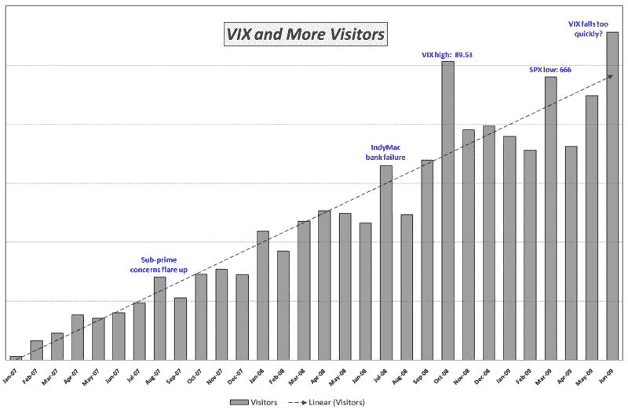

<!--yml

类别：未分类

日期：2024-05-18 17:39:14

-->

# 维基百科: 波动率下降之际 VIX 关注度激增

> 来源：[`vixandmore.blogspot.com/2009/07/interest-in-vix-spikes-as-volatility.html#0001-01-01`](http://vixandmore.blogspot.com/2009/07/interest-in-vix-spikes-as-volatility.html#0001-01-01)

当[VIX 在去年 10 月超过 80](http://vixandmore.blogspot.com/search/label/VIX%20spikes)时，我一点也不惊讶，这个博客读者量也出现了类似的激增。事实上，自 2007 年 1 月博客成立以来，访问博客的访客量与 VIX 和各种波动率事件高度相关。这种现象并不仅限于*VIX and More*。作为一个一般原则，每当投资者焦虑加剧，对高质量信息和洞见的最大需求时，所有金融信息来源的读者量都会增加。

然而，让我感到惊讶的是，最近几周对 VIX 的持续关注度之高，更不用说 VIX 跌破 30 点所引起的争议了。显然，VIX 并非是一匹一次性的脉冲马，投资者已经高度关注关于波动率水平和它们含义的更复杂对话。上月，博客的读者量达到新的高峰，超过了去年 10 月的 VIX 疯狂追捧。在下面的图表中，我注明了引发读者量突破长期趋势线的事件。据我所知，上月是读者量因为对 VIX*低位*的担忧而激增的第一次。

显然，VIX 是来势汹汹，并将持续存在。尽管我很喜欢探索我的博客名片的“…以及更多”部分，但我会尽力至少与 Adam Warner 在[每日期权报告](http://adamsoptions.blogspot.com/)上关于 VIX 的文章数量相匹配。

*[图表：VIXandMore]*
