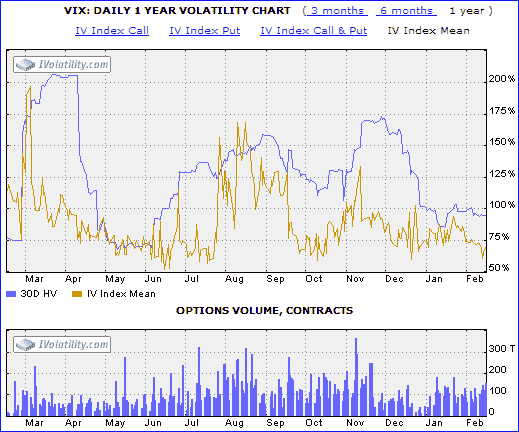

<!--yml

category: 未分类

date: 2024-05-18 18:43:15

-->

# VIX and More: Interest in VIX Waning?

> 来源：[`vixandmore.blogspot.com/2008/02/interest-in-vix-waning.html#0001-01-01`](http://vixandmore.blogspot.com/2008/02/interest-in-vix-waning.html#0001-01-01)

许多读者想知道，在市场大幅下跌的情况下，VIX 指数最近缺乏波动性是否表明 VIX 正在失去一些相关性。这是一个公平的问题。

As the graphic to the right indicates, not only is the implied volatility and historical volatility of the VIX currently hovering near 52 week lows – when clearly investor fear is not similarly lax – but since about mid-November or thereabouts, the volume of VIX options traded has dropped dramatically as well.  In fact, with the benefit of hindsight, it appears that the popularity of VIX options surged from May through November of 2007, only to have recently returned to the levels that preceded the anxiety over the subprime problems and all the dominoes since uncovered that appear to have been within tipping range.

Of course, if the [VIX’s beta](http://vixandmore.blogspot.com/2007/10/more-thoughts-and-numbers-on-spx-vix.html) starts dropping below historical levels, it is possible that we may have a situation in which, as [I described previously](http://vixandmore.blogspot.com/2008/01/volatility-rip.html), the less the VIX moves, the less valuable (reliable) it becomes as a highly leveraged hedge against long market positions.

One of the theories about the lack of action in the VIX is that those who are looking for another way to have a highly leveraged hedge have flocked to the inverse and double inverse ETFs.  Did anything happen in November that might support that theory?  Well, lo and behold, it turns out that the most popular of the double inverse ETFs, the [QID](http://vixandmore.blogspot.com/search/label/QID), just happened to start trading options in November.  Coincidence?  I suspect not.  While the volume of QID options relative to VIX options is rather small, clearly the game has changed.

This observation is not going to persuade me to change the name of the blog, but don’t be surprised if you see me posting about the QID more often.  After all, as the chart on the bottom shows, QID volume (and on balance volume) has demonstrated considerable predictive potential over the past year.
