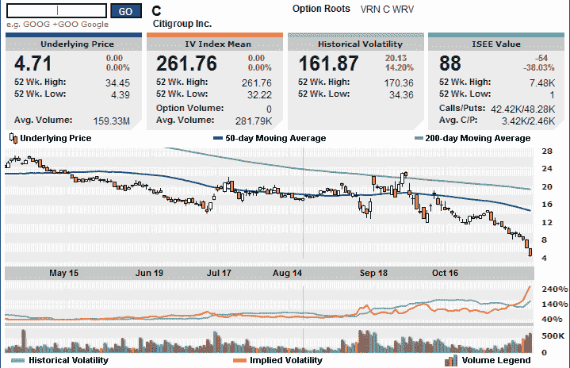

<!--yml

分类：未分类

日期：2024-05-18 18:14:54

-->

# VIX 和更多：国际证券交易所重塑隐含波动率图表

> 来源：[`vixandmore.blogspot.com/2008/11/international-securities-exchange.html#0001-01-01`](http://vixandmore.blogspot.com/2008/11/international-securities-exchange.html#0001-01-01)

国际证券交易所([ISE](http://vixandmore.blogspot.com/search/label/ISE))发布了一个我曾在*VIX 和更多*中多次介绍的卓越的[隐含波动率](http://vixandmore.blogspot.com/search/label/implied%20volatility)图表，该交易所最近推出了一个[改进的波动率图表](http://www.ise.com/WebForm/md_livevol.aspx?categoryId=124&header3=true&menu1=true)。这个图表的新版本在数据列表中增加了一个“ISEE 价值”。我在此空间过去经常讨论[ISEE](http://vixandmore.blogspot.com/search/label/ISEE)看涨/看跌比率。在这个版本中，它仅仅是特定证券的看涨交易量与看跌交易量的比率。

我选择花旗集团([C](http://vixandmore.blogspot.com/search/label/C))作为我的示例证券，因为所有目光都应关注这家银行，它在今天早上早些时候触及 3.57 后，目前交易于 14 年低点。如果花旗集团崩溃，它将远远超过[AIG](http://vixandmore.blogspot.com/search/label/AIG)和雷曼兄弟所造成的混乱。

最后，为了了解更多关于为 ISE 提供波动率图表的公司信息，请查看[Livevol](http://www.livevol.com/Default.aspx)。

*[来源：国际证券交易所]*
