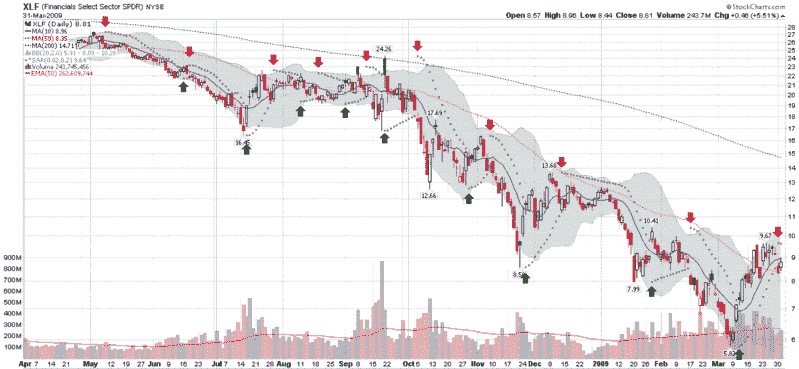

<!--yml

类别：未分类

日期：2024-05-18 17:53:30

-->

# VIX and More: 介绍抛物线停损和反转（SAR）

> 来源：[`vixandmore.blogspot.com/2009/03/introducing-parabolic-stop-and-reverse.html#0001-01-01`](http://vixandmore.blogspot.com/2009/03/introducing-parabolic-stop-and-reverse.html#0001-01-01)

昨天，一位读者询问了抛物线停损反转指标（有时称为 PSAR 或 [SAR](http://vixandmore.blogspot.com/search/label/SAR)）的用处。由于这是我最喜欢的非主流指标之一，我想我会花点时间提及我喜欢 SAR 的一些原因。事情就这样发展，然后我意识到，我的简单回答已经变成了托尔斯泰式的篇幅。因此，我将在几篇文章中探讨 SAR。

SAR 是由威尔斯·怀尔德在 1978 年的开创性经典作品 [《技术交易系统的新概念》](http://www.amazon.com/New-Concepts-Technical-Trading-Systems/dp/0894590278/ref=sr_1_1?ie=UTF8&s=books&qid=1238510516&sr=1-1) 中揭示的。即使经过三十多年，这本书中的成就仍令人瞠目。怀尔德一举推出了 RSI（相对强度指数）、ATR（[真实波幅](http://vixandmore.blogspot.com/search/label/average%20true%20range)）、[ADX](http://vixandmore.blogspot.com/search/label/ADX)（平均方向指标）和 SAR，以及几个较不知名的指标（例如商品选择指数、摆动指数等），这些指标可能值得更多关注。

当涉及到向技术分析工具箱中添加更多指标时，我总是有些犹豫，因为我更倾向于保持简单而不是使其过于复杂。对指标的“少即是多”偏好部分是因为许多指标共享一些计算血统，其增值通常远远不如其表面所见。

考虑到这些注意事项，我认为 SAR 是一个例外情况。具体来说，SAR 是价格和时间的独特组合。它在趋势市场中表现特别出色，也许最适合作为一种跟踪止损机制实施。

这一次，我不会深入探讨 SAR 的计算细节；相反，我将简要概述 SAR 的工作原理。在下图中，我捕捉了金融 ETF [XLF](http://vixandmore.blogspot.com/search/label/XLF) 过去一年的数据。紫色点代表 SAR 值，它们是覆盖在价格图表上的。当紫色点位于蜡烛图下方时，这表明价格上涨；当紫色点位于蜡烛图上方时，这表明价格下跌。每当发出趋势变化的信号时，紫色点会从底部翻转到顶部，或从顶部翻转到底部。为了更容易识别这些反转信号，我添加了绿色和红色箭头表示趋势反转。

SAR 假设交易者始终在市场中。简单地说，当趋势反转时，SAR 信号应该建立新头寸。为了了解 SAR 值是如何变化的，回顾一下十二月中旬第二周的新空信号。注意 SAR 远高于最初的空头入场信号，但随着时间推移，SAR 仍然沿着原始信号的方向移动，无论市场是否跟随趋势。这使得 SAR 在年初价格附近。也要注意，当 XLF 在一月初开始急剧下跌时，SAR 随之加速下跌并紧随价格行动。当 XLF 在一月底最终反转到最后一刻，追踪止损如此之紧，仅一个看涨跳空上涨的日子就触发了退出。这就是 SAR 的精髓：它给逐渐趋势一些时间来积聚动力，紧贴急剧趋势，并在趋势开始改变方向时充当紧止损。

现在研究一下图表的平衡。注意到了吗？当 XLF 处于持续趋势中（比如五月、六月、十月等）时，SAR 表现非常好。然而，当 XLF 横盘交易，就像八月那样时，SAR 造成了不少假信号。

在这个系列下一篇文章中，我将更深入地探讨 SAR 背后的计算，并讨论一些应用这个指标的首选方法。

*[来源：StockCharts]*
