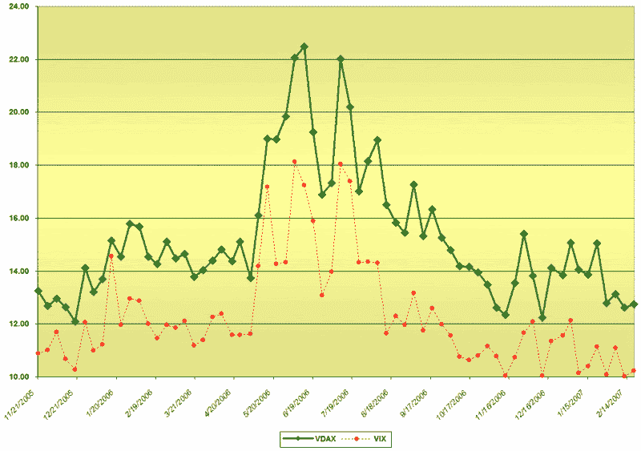
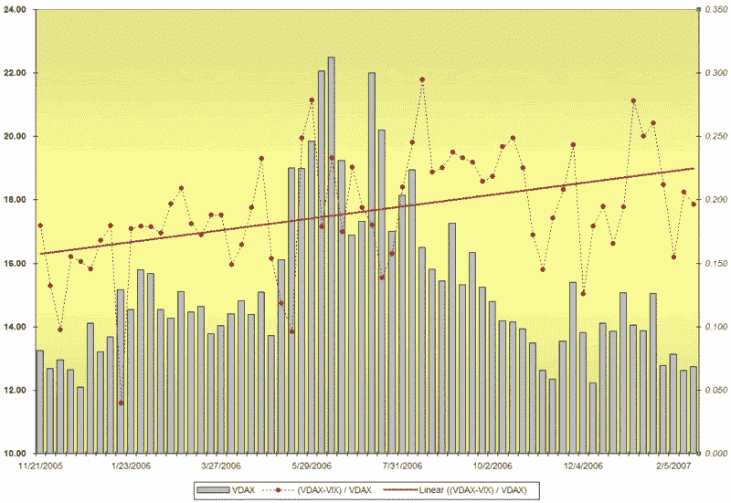

<!--yml

分类：未分类

日期：2024-05-18 15:58:06

-->

# VIX and More: 介绍 VDAX

> 来源：[`vixandmore.blogspot.com/2007/02/introducing-vdax.html#0001-01-01`](http://vixandmore.blogspot.com/2007/02/introducing-vdax.html#0001-01-01)

所以我在自我吹嘘，达利的《记忆的永恒》（[The Persistence of Memory](http://en.wikipedia.org/wiki/The_Persistence_of_Memory)）是我即将完成的关于不断缩小的 VIX 数字和我们集体时间感知扭曲的完美伴侣时，决定去访问我[最喜欢的期权博客](http://adamsoptions.blogspot.com/)。我停顿了一下，然后又看了一次。哦，看来我错误地打开了我的草稿。不，结果我发现我自己的超现实主义时刻来了。达利的融化时钟在另一个博客上出现，就在它们预定在我的博客上出现的几分钟前。

这让我感觉好像是我持仓最大的首席财务官突然辞职了，所以我决定今天换一个方向。换一个大洲…

所以，今天我要介绍 VDAX！实际上，就像 VIX 和旧的 VXO 一样，德国交易所（Deutsche Börse）也有一个新的[VDAX](http://deutsche-boerse.com/dbag/dispatch/en/isg/gdb_navigation/trading_members/45_Indices/36_volatility_indices/80_VDAX?module=InOverview_Index&wp=DE000A0DMX99&foldertype=_Index&wplist=DE000A0DMX99&active=overview&timespan=1d)（也称为 VDAX-NEW）和一个旧的[VDAX](http://deutsche-boerse.com/dbag/dispatch/en/isg/gdb_navigation/trading_members/45_Indices/36_volatility_indices/80_VDAX?active=overview&module=InOverview_Index&wp=DE0008467408&wplist=DE0008467408&foldertype=_Index&wpbpl=ETR)。两者最大的区别在于，VDAX-NEW 是从[DAX](http://en.wikipedia.org/wiki/DAX)（德国的道琼斯工业平均指数）期权中推算出的隐含波动率，期限为 30 天，而原始的 VDAX 则是向前看 45 天。

我们将在稍后的时间更深入地讨论 VDAX 以及其他国际波动率指数，但今天我想提出并回答两个问题：

+   那么 VIX 和 VDAX 之间有什么联系呢？

+   一个波动率指数相对于另一个指数领先或落后多少？

为了回答这些问题，我依赖的只有原始 VDAX 的数据，因为我的数据集更好。VDAX 和 VDAX-NEW 非常高度相关；在下面的两个图表中，我使用了原始 VDAX 的数据：

（[VDAX VIX 周走势图](http://i104.photobucket.com/albums/m163/bl82/VDAXVIXweekly.gif)）

（[VDAX VIX 周走势及差异百分比](http://i104.photobucket.com/albums/m163/bl82/VDAXVIXweeklyanddiffpct.gif)）

注意周 VDAX 与周 VIX 之间的强烈相关性。在第二个图表中，红色虚线和该数据系列的实线“最佳拟合”线表示 VDAX 和 VIX 之间的差异占 VDAX 的百分比。VDAX 和 VIX 之间的这种差异表明，至少在过去的一年左右时间里，美国市场的波动性消散速度比德国市场快。

正如大多数对<country-region st="on">美国</country-region>和国际市场的比较所显示的，<country-region st="on">美国</country-region>市场在波动性变动方面往往占据领先地位，而外国市场通常是对<country-region st="on"><place st="on">美国</place></country-region>的变化作出反应。在 2003 年，<place st="on"><city st="on">索菲安</city></place> Aboura 在*[国际波动性传输研究：基于波动性指数 VX1、VDAX 和 VIX 的分析](http://papers.ssrn.com/sol3/papers.cfm?abstract_id=514282)*中总结道：“VIX 中包含的信息流在同一天全球传输到 VX1*[由[CAC 40](http://en.wikipedia.org/wiki/CAC_40)衍生而来]*，而在前两天则通过 VDAX 传输到德国市场。我们再次注意到<place st="on"><country-region st="on">美国</country-region></place>和法国隐含波动指数之间的同时关系。”

所以，既然同一个大陆曾孕育出萨尔瓦多·达利，那么我们就有 VDAX——我们还将与达利有个约会，讨论不久的将来的波动性问题。与此同时，我会留下他的一句引语：

~ “不要害怕完美，你永远也达不到它。” ~ <place st="on"><city st="on">萨尔瓦多</city></place> Dali
