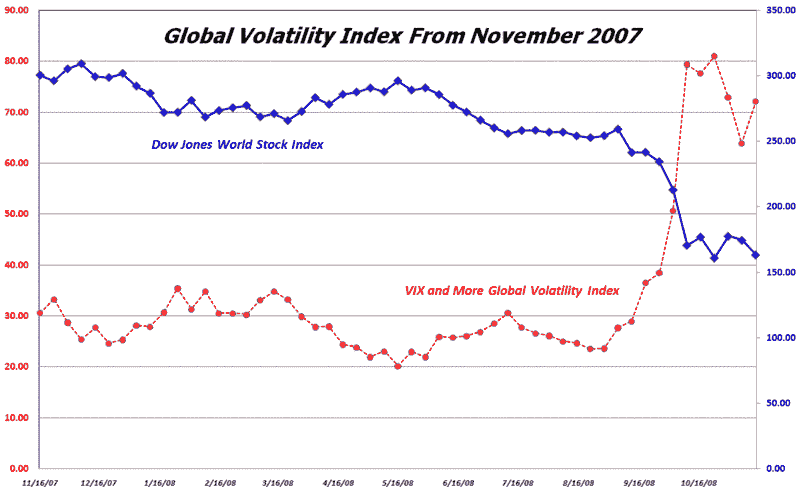

<!--yml

分类：未分类

日期：2024-05-18 18:16:13

-->

# VIX 和更多：介绍 VIX 和更多全球波动指数

> 来源：[`vixandmore.blogspot.com/2008/11/introducing-vix-and-more-global.html#0001-01-01`](http://vixandmore.blogspot.com/2008/11/introducing-vix-and-more-global.html#0001-01-01)

随着 G20 的代表们聚集在华盛顿讨论全球经济的状况，这似乎是一个很好的时机来揭开*VIX 和更多* [全球波动指数](http://vixandmore.blogspot.com/search/label/Global%20Volatility%20Index)的面纱。

不详细说明所有细节，全球波动指数计算了[15 个最大全球经济体](http://en.wikipedia.org/wiki/List_of_countries_by_GDP_%28nominal%29)的股票期权隐含波动性的加权平均值，这些经济体代表了大约 76%的世界经济活动。

据我所知，这是首个此类指数，之前的波动指数限于特定国家的波动性，或者在[VSTOXX](http://vixandmore.blogspot.com/search/label/VSTOXX)的情况下，限于欧元区。

下面的图表绘制了全球波动指数与[道琼斯全球股票指数](http://vixandmore.blogspot.com/search/label/Dow%20Jones%20World%20Stock%20Index)在过去一年中的对比。全球波动指数为市场分析和解读开辟了许多新的领域，我将在接下来的几周内在本文中更多地讨论这些内容。

[来源：VIX 和更多]
