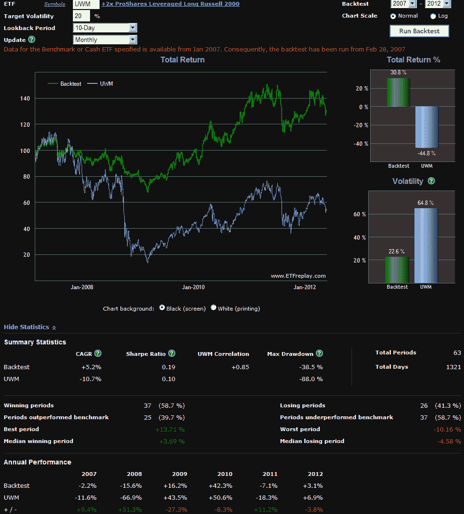

<!--yml

类别：未分类

日期：2024-05-18 16:29:35

-->

# VIX 和更多：采用目标波动性方法进行投资

> 来源：[`vixandmore.blogspot.com/2012/05/investing-with-target-volatility.html#0001-01-01`](http://vixandmore.blogspot.com/2012/05/investing-with-target-volatility.html#0001-01-01)

既然我今天早些时候提到了我最喜欢的 ETP 网站之一 *[想到这里，我越来越倾向于认为* [*年度最佳交易所交易产品帖子*](http://vixandmore.blogspot.com/2012/05/best-post-of-year-on-exchange-traded.html) *是我见过的关于这个话题最好的帖子]*，我觉得在那个必要的周末阅读中加入一些功能可能是个好主意。

另一个出色的 ETP 网站，[ETFreplay.com](http://etfreplay.com/)，最近推出了一款波动率目标回测工具。这个工具的设计目的是展示如果一个人采取了像杠杆 ETP、[VIX-based ETP](http://vixandmore.blogspot.com/search/label/VIX%20ETN)等高波动率 ETP，并结合动态现金分配和历史波动率数据来限制对目标波动率上限的暴露，历史回报会是什么样子。

一个例子可能让这更容易形象化。假设你对比特 Russell 2000 小市值股票指数持乐观态度，并希望通过 +2x 杠杆 ETP，ProShares Ultra Russell2000([UWM](http://vixandmore.blogspot.com/search/label/UWM))对这些股票获得一些多头暴露。然而，去年八月，UWM 的 10 日历史波动率超过 160，而现在它为 41 - 你决定这些波动水平是不可接受的，特别是在[希腊](http://vixandmore.blogspot.com/search/label/Greece)和整个欧元区存在这么多不确定性的时候。

解决方案？动态分配 UWM 和现金之间的组合如何？（在这里使用 iShares Barclays 1-3 年国债债券[SHY](http://vixandmore.blogspot.com/search/label/SHY)，）基于 10 日历史波动率数据，目标是 20%的前瞻性波动率水平。

下面的图表显示了使用每月再平衡周期且始于 2007 年 1 月的 ETFreplay 回测组合的结果，当时 UWM 刚刚推出。

当然，过去的结果并不能保证这种策略在未来可能如何运作（杠杆 ETP 当然对长期投资者涉及很大的复合衰减风险），但这个图表对牛市和熊市都很吸引人。将这种方法视为一种将风险产品细调到所需波动水平的方式。

祝大家周末愉快！

相关文章：

**

*[来源(s)：ETFreplay.com]*

***披露(s)：*** *无*
