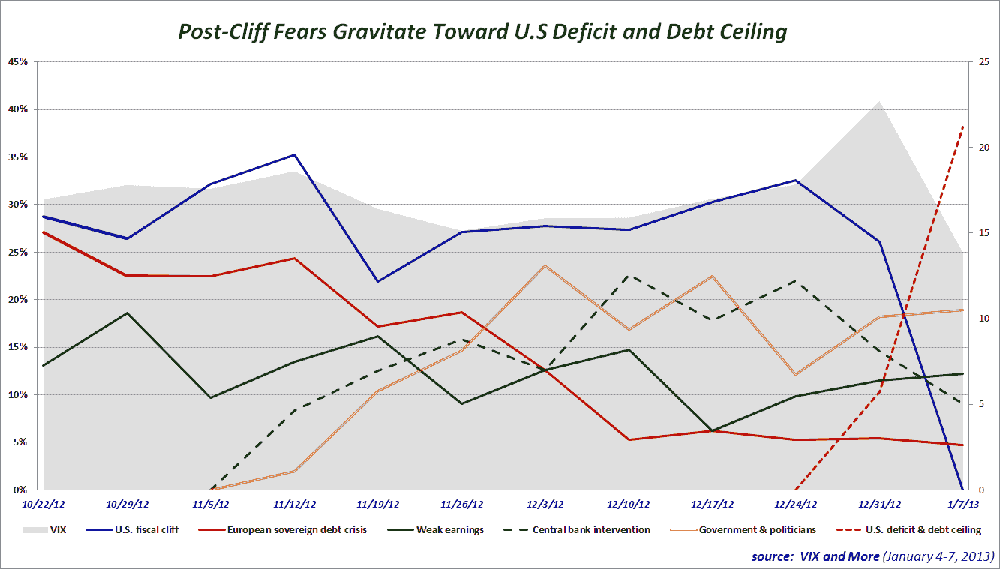

<!--yml

category: 未分类

date: 2024-05-18 16:19:25

-->

# VIX and More:投资者恐惧转向美国赤字和债务上限，悬崖协议后

> 来源：[`vixandmore.blogspot.com/2013/01/investor-fears-pivot-to-us-deficit-and.html#0001-01-01`](http://vixandmore.blogspot.com/2013/01/investor-fears-pivot-to-us-deficit-and.html#0001-01-01)

就在民主党和共和党匆忙达成最后时刻的[财政悬崖](http://vixandmore.blogspot.com/search/label/fiscal%20cliff)协议一周后，投资者将焦点转向财政危机的下一个战场，将美国赤字和[债务上限](http://vixandmore.blogspot.com/search/label/debt%20ceiling)列为*VIX and More*周度[恐惧调查](http://vixandmore.blogspot.com/search/label/Fear%20poll)中的首要担忧。与政府和政治家相关的担忧排在遥远的第二位，而与疲弱的公司盈利相关的持续担忧排在第三位，就在铝业公司 Alcoa([AA](http://vixandmore.blogspot.com/search/label/AA))正式开启 Q4 盈利报告季的前一天。

在上一个季度末主导投资者恐惧调查的两大问题似乎已经从大多数投资者的意识中淡出。尽管财政悬崖的影响在债务上限讨论中仍然存在，但直接的威胁已经过去。与此同时，尽管有安格拉·默克尔等人士的警告，与[欧洲主权债务危机](http://vixandmore.blogspot.com/search/label/European%20sovereign%20debt%20crisis)相关的担忧仍处于低水平，并继续下降。

在机构层面，财政悬崖的一个遗留影响是，投资者持续担忧财政悬崖只是功能失调的两党政府的新爱——边缘政策的一个症状。另一方面，对中央银行过度干预的担忧正在下降，毫无疑问，最近[FOMC](http://vixandmore.blogspot.com/search/label/FOMC)在 12 月 11 日至 12 日会议的[纪要](http://www.federalreserve.gov/newsevents/press/monetary/fomcminutes20121212.pdf)在这方面提供了帮助。

在 VIX 上周创下纪录的一周跌幅后，可以合理地得出结论，投资者对财政悬崖的担忧程度远高于与美国债务上限和赤字相关的担忧。事实上，关于 VIX 下降与财政悬崖协议之间的关系有一些分歧意见。关于这个话题，可以查看 Jared Woodard of [Condor Options](http://condoroptions.com/)在[The Market Is As Nervous as Ever About Austerity Fetishisms](http://condoroptions.com/2013/01/07/the-market-is-as-nervous-as-ever-about-austerity-fetishism/)中的评论，Jared 延续了高盛公司(Goldman Sachs)最近一份报告中的主题。

再次感谢所有参与本周投票的人。

相关文章：

**披露（s）：** *无*
