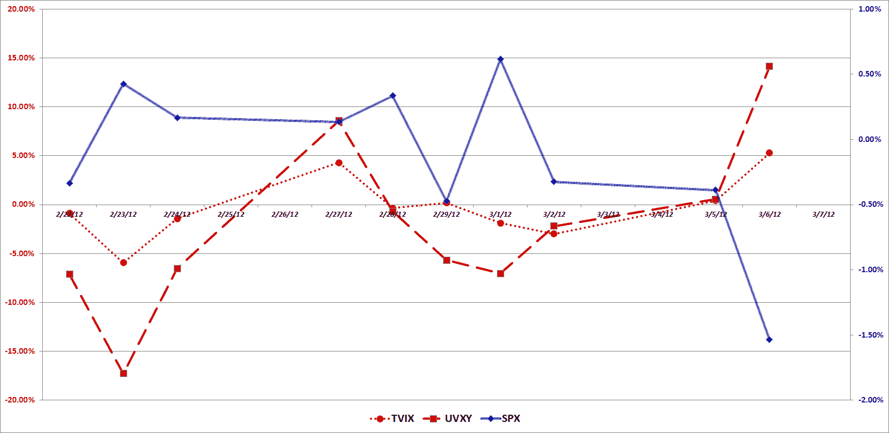

<!--yml

category: 未分类

日期：2024-05-18 16:36:37

<!--

# 《VIX and More》：TVIX 现在只是更加温和的 UVXY 吗？

> 来源：[`vixandmore.blogspot.com/2012/03/is-tvix-now-just-more-docile-uvxy.html#0001-01-01`](http://vixandmore.blogspot.com/2012/03/is-tvix-now-just-more-docile-uvxy.html#0001-01-01)

自从 2 月 21 日**Credit Suisse**（[CS](http://vixandmore.blogspot.com/search/label/CS)）宣布在常规交易时段结束后暂停 VelocityShares Daily 2x VIX Short-Term ETN ([TVIX](http://vixandmore.blogspot.com/search/label/TVIX))的新创建单位以来，今天是第 11 个交易日。

在此期间，各种投资者、评论家、行业玩家和媒体成员都试图把握这一举措对 TVIX、更广泛的 VIX 交易所交易产品（ETPs）乃至整个 VIX 期货市场的含义。

**Dave Nadig** 和 **Gene Koyfman** 在《Index Universe》上发表的文章《Volatility ETFs Own All VIX Futures》对 TVIX 和 VIX 期货市场提出了一个发人深省的视角，我认为这是必读的文章。金融时报的**Izabella Kaminska** 很好地总结了 VIX ETP 尾部摇摆 VIX 期货狗的可能影响，她想知道是否到了对 VIX 期货设置头寸限制的时候，详见她的文章《Time for Position Limits on VIX Futures?》。

虽然我对 TVIX 创建单位停止引发的监管、交易所和内部风险管理问题感到兴趣，但我更想知道市场干扰如何改变了某些证券的运行方式以及这些变化对交易的影响。

在下面的图表中，我绘制了过去十交易日 TVIX、[UVXY](http://vixandmore.blogspot.com/search/label/UVXY)以及标普 500 指数的每日走势。简而言之，最初看似 TVIX 在市场下跌时表现得比 UVXY 要好，但现在看来，TVIX 在上涨时也显得更为迟钝。尽管在过去十天里 TVIX 的表现优于 UVXY，但 TVIX 和 UVXY 之间脱节的最有力解释是，新的市场环境大幅降低了 TVIX 的贝塔值。换句话说，TVIX 现在更像是处于(+1x) [VXX](http://vixandmore.blogspot.com/search/label/VXX) 的领域而不是(+2x) UVXY——并且与 VXX 更为接近。在过去十天内，UVXY 的 10 日历史波动率为 117，而 VXX 的 10 日历史波动率为 60。那 TVIX 呢？嗯，在此期间 TVIX 的*表现甚至比 VXX 更为温和*，历史波动率读数仅为 45。

至少到目前为止，TVIX 似乎远没有我预期的那么容易剧烈波动。然而，这并不排除未来某个时候 TVIX 可能会出现逼空行情。买家——以及卖家——请小心。

相关文章：

**来源(s): TD Ameritrade**

***披露(s):*** *在撰写本文时做空 TVIX、UVXY 和 VXX*
