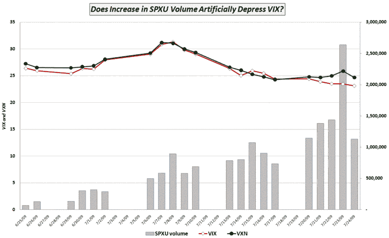

<!--yml

分类：未分类

date: 2024-05-18 17:36:39

-->

# VIX 和更多：VIX 是否因 SPXU 的增加使用而受到人为压抑？

> 来源：[`vixandmore.blogspot.com/2009/07/is-vix-being-artificially-depressed-by.html#0001-01-01`](http://vixandmore.blogspot.com/2009/07/is-vix-being-artificially-depressed-by.html#0001-01-01)

VIX 持续下跌至 25.00 以下，让许多交易者包括本作者都感到意外。

如果研究一下上周五的[影响 VIX 的力量](http://vixandmore.blogspot.com/2009/07/forces-acting-on-vix.html)，很快就会确定，除了少数例外，图形中与力量相关的恐惧和不确定性在过去几个月里已经迅速减少。

我提到的其中一个力量收到了非常少的关注，并且很可能被交易者们低估了——如果被考虑的话。这是 SPX 对冲替代品的增长。由于 VIX 强烈受到 SPX 看跌期权需求的影響，任何 SPX 看跌期权的替代品都可能通过将需求转向其他对冲产品而“人为”地降低 VIX 水平。历史上，这些替代品包括期货、期权和各种形式的掉期。然而，随着对 ETF 兴趣的增加，特别是杠杆 ETF，替代品的菜单已经大幅增加。

在金融危机高峰期，[我记录了](http://vixandmore.blogspot.com/2008/02/rising-popularity-of-xlf-options.html)许多投资者是如何放弃 SPX 和 SPY 看跌期权，转而选择针对金融部门的看跌期权的。

随着看跌-3 倍短期 ProShares([SPXU](http://vixandmore.blogspot.com/search/label/SPXU))的引入，一个旨在复制 SPX 每日 300%波动的三倍 ETF([triple ETF](http://vixandmore.blogspot.com/search/label/triple%20ETFs))，我相信交易者们已经找到了一种开始影响 VIX 的 SPX 期权的替代品，并且已经接受了它。

下面的图表显示了 SPXU 近期交易量的增加恰好与 VIX 和[VXN](http://vixandmore.blogspot.com/search/label/VXN)的分离一致。同样的因素无疑也在影响波动率期限结构，并且可能解释了最近[VIX:VXV 比率](http://vixandmore.blogspot.com/search/label/VIX%3AVXV)的低读数。

我暂时将图标的标题留作一个修辞问题，因为一个月的时间必然远远达不到任何统计证明。不过，如果 SPXU 及其+3 倍兄弟[UPRO](http://vixandmore.blogspot.com/search/label/UPRO)继续吸引更多关注和交易量，无论是作为对冲工具还是作为投机性交易，不要感到惊讶。随着基于 SPX 的杠杆 ETF 市场份额的增加，对 SPX 看跌期权的兴趣——以及 VIX 的绝对水平——可能会显著下降。

有关相关文章，请参阅：

*[图表: VIXandMore]*
