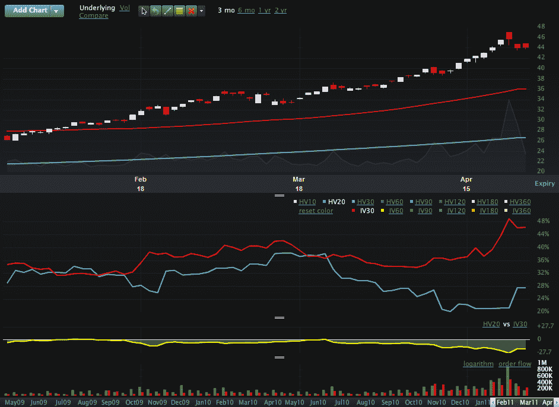

<!--yml

类别：未分类

日期：2024-05-18 16:50:51

-->

# VIX and More: 波动率是银的更好选择吗？

> 来源：[`vixandmore.blogspot.com/2011/04/is-volatility-better-play-for-silver.html#0001-01-01`](http://vixandmore.blogspot.com/2011/04/is-volatility-better-play-for-silver.html#0001-01-01)

似乎全世界的人都有关于银的意见。银是个泡沫吗？已经见顶了吗？只是在三倍数字之前进行整理吗？

几个月来，我一直以趋势跟踪的方式交易银的方向性，但最近在我得出顶部即将到来的决定时，我退出了所有的多头头寸。

然而，银看起来对我而言过于有吸引力，让我无法置身事外，因此我现在交易的是银的波动率，而不是方向性交易。下面来自 Livevol.com 的图表清晰地说明了我的理由。

观察过去六个月银的 ETF [SLV](http://vixandmore.blogspot.com/search/label/SLV)，人们无法不注意到在三月份后半段[隐含波动率](http://vixandmore.blogspot.com/search/label/implied%20volatility)和[历史波动率](http://vixandmore.blogspot.com/search/label/historical%20volatility)之间的差距越来越大。虽然可以理解鉴于近期波动率的极端情况，人们对银的未来价格存在很大的不确定性，但我发现很难相信交易员们认为银下个月的波动率将是上个月的两倍。

对我个人而言，这是一个典型的波动率空头设置，[价差期权](http://vixandmore.blogspot.com/search/label/straddle)、[价差期权](http://vixandmore.blogspot.com/search/label/strangle)、[蝴蝶期权](http://vixandmore.blogspot.com/search/label/butterfly)和[秃鹰期权](http://vixandmore.blogspot.com/search/label/condor)都在定价中包含了过多的波动率。没有必要一定以 SLV（约 44.18）的价格作为价差的中点来构建这些波动率空头交易。如果一个人认为银已经见顶，为什么不卖出 43 的价差期权或者一个 40-45 价差的价差期权呢？目前我的主要关注点是一个非方向性的波动率空头交易，但也可以为至少我看来是一个带有小方向性偏差的波动率空头交易辩护。

当然，银总是提供一些有趣的配对交易可能性，通常与黄金有关，但由于银与股票的近期正相关性，一个有趣的方法是考虑将银的空头交易作为对长期股权头寸的对冲。

相关文章：

*[图形：Livevol Pro]*

********披露(s)：********在撰写本文时，通过期权持有 SLV 的中性头寸；Livevol 是 VIX and More 的广告商**
