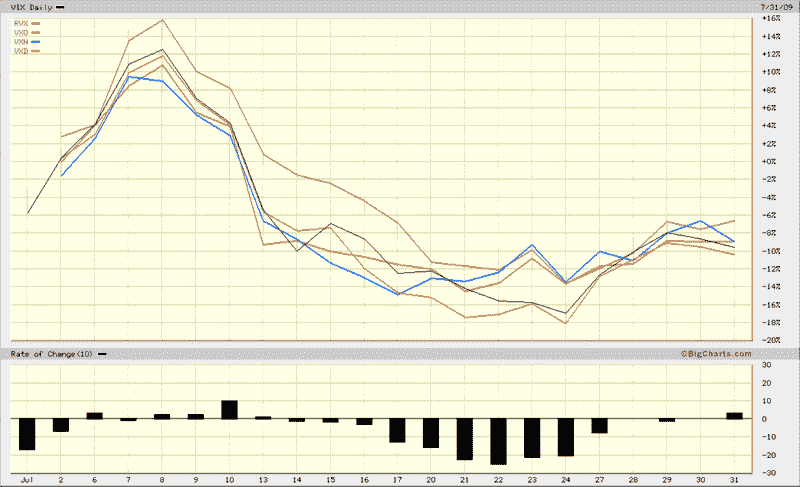
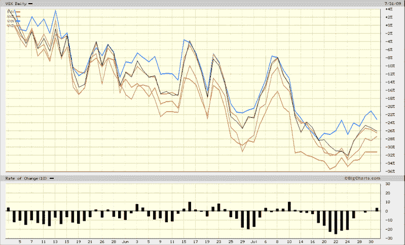

<!--yml

分类：未分类

日期：2024-05-18 17:35:54

-->

# VIX and More: Is the VIX Being Gamed?

> 来源：[`vixandmore.blogspot.com/2009/07/is-vix-being-gamed.html#0001-01-01`](http://vixandmore.blogspot.com/2009/07/is-vix-being-gamed.html#0001-01-01)

在[Fear Index Now Inverse to VIX](http://www.zerohedge.com/article/fear-index-now-inverse-vix)中，Zero Hedge 最近提出了这样一个观点，即 VIX“被波动性卖方操纵”并且可能是“幕后操纵最严重的指数”。

有几个读者让我对此发表评论。简而言之，我不相信 VIX 被操纵到了任何显著的程度。我关注的波动性数据包括各种主要波动性指数之间的相关性，包括 VIX、[VXN](http://vixandmore.blogspot.com/search/label/VXN)（纳斯达克 100 指数）、[RVX](http://vixandmore.blogspot.com/search/label/RVX)（罗素 2000 指数）、[VXO](http://vixandmore.blogspot.com/search/label/VXO)（标普 100 指数）和[VXD](http://vixandmore.blogspot.com/search/label/VXD)（道琼斯工业平均指数）。历史上，这些相关性最低的是市值两端，RVX 和 VXO 之间的 97%相关性。坦白说，在过去几周里，我没有看到太多历史模式的偏离。下面的图表显示了过去一个月（顶部）和过去三个月（底部）的五个波动性指数。如果有什么证据支持 VIX 与其他波动性指数不符，我没有看到。

请注意，由于 VXO 没有任何与之相关的期权或期货，操纵这个波动性指数可能是最难和最昂贵的。同时考虑，由于 VXO 的成分股具有所有波动性指数中最大的市值，人们预计 VXO 的变化会比由市值较小且更具波动性的公司组成的其他指数的变化要小。

有关其他次级波动性指数的相关文章，请尝试：

来源：[BigCharts]

***披露***：撰写本文时持有 VIX。
