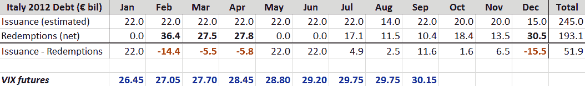

<!--yml

类别：未分类

日期：2024-05-18 16:45:01

-->

# VIX 和更多：意大利主权债务时间表和 VIX

> 来源：[`vixandmore.blogspot.com/2011/12/italys-sovereign-debt-schedule-and-vix.html#0001-01-01`](http://vixandmore.blogspot.com/2011/12/italys-sovereign-debt-schedule-and-vix.html#0001-01-01)

当我思考 2012 年欧洲主权债务危机带来的风险时，首先想到的是意大利明年必须滚动的大量债务。在昨天的员工会议/与洛根的跑步中（[狗能告诉我们关于波动性的什么](http://vixandmore.blogspot.com/2007/01/what-my-dog-can-tell-us-about_947.html)），我甚至提出了半吸引人的标签“[顶峰再融资](http://vixandmore.blogspot.com/search/label/peak%20refinancing)”。他对这并不是特别印象深刻…

但我相信在那平静的态度下，洛根也在担心意大利以及这个关键国家如何妥善管理再融资的负担。特别关注的是，再融资时间表在二月至四月有三个月的时期，到期的债务特别大——917 亿欧元，仅略低于全年总赎回的一半。

下表总结了意大利 2012 年发行的月度估计（[根据 HSBC](http://www.research.hsbc.com/midas/Res/RDV?ao=20&key=GJ8vi0PuPs&n=311048.PDF)），以及每个月的赎回计划和净发行减去赎回的时间表。

在为 2012 年欧洲的高焦虑和可能全面爆发的危机规划时间时，人们可能会认为意大利的债务时间表在这些计算中占据重要位置。我也期待看到这份时间表的一些内容转化为提高的[VIX 期货](http://vixandmore.blogspot.com/search/label/VIX%20futures)，我已将它们包括在下面表格的最下面。事实上，2012 年的 VIX 期货[期限结构](http://vixandmore.blogspot.com/search/label/term%20structure)与八月下跌前非常相似，完全没有暗示波动性可能在二月、三月或四月达到顶峰。

在为 2012 年的期权定价时，请记住意大利的债务时间表，无论 VIX 期货是否关注这个问题。

相关文章：

来源(s): 意大利财政部，HSBC，Interactive Brokers

***披露(s):*** *无*
