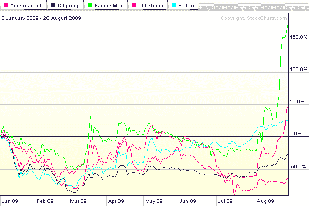
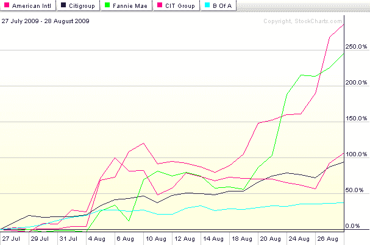

<!--yml

分类：未分类

date: 2024-05-18 17:31:27

-->

# VIX 和更多：JunkDEX 组成部分的表现

> 来源：[`vixandmore.blogspot.com/2009/08/junkdex-component-performance.html#0001-01-01`](http://vixandmore.blogspot.com/2009/08/junkdex-component-performance.html#0001-01-01)

我很高兴看到[JunkDEX 追踪金融领域的投机狂潮](http://vixandmore.blogspot.com/2009/08/junkdex-tracks-speculative-frenzy-in.html)以及[JunkDEX](http://vixandmore.blogspot.com/search/label/JunkDEX)本身似乎触动了人们的神经，并收到了如此积极的反馈。

在一定程度上，可以说 JunkDEX 的个别组成部分的选择是相当随意的，因此，该指数的表现受到了选定股票的影响，这些股票讲述了一个特定的故事。

我已经提到了 Freddie Mac ([FRE](http://vixandmore.blogspot.com/search/label/FRE))的排除，主要因为该公司的业务、财务历史和股票表现与 Fannie Mae ([FNM](http://vixandmore.blogspot.com/search/label/FNM))非常相似。我还研究了 Lehman Brothers ([LEHMQ](http://vixandmore.blogspot.com/search/label/LEHMQ)),它给了我们[LEHVIX](http://vixandmore.blogspot.com/2008/06/lehvix.html)等回忆。LEHMQ 在周五上涨了 200%，到目前为止今天又上涨了 50%。我甚至考虑过通用汽车([MTLQQ](http://vixandmore.blogspot.com/search/label/MTLQQ)),但正因为这些问题在粉单市场交易，我不想进入那个幽暗世界。

为了提供一些历史背景，我认为提供一些 JunkDEX 个别组成部分的表现图表会有所帮助。第一个图表涵盖了 JunkDEX 自 2009 年初以来的整个时期。它特别显示了 Fannie Mae 和 American International Group ([AIG](http://vixandmore.blogspot.com/search/label/AIG))的强劲表现：

第二个图表反映了在过去五周内每个组成部分的表现。鉴于这个数据相对较短的时间框架，我觉得百分比变化更有趣。尽管 FNM 和 AIG 仍然是表现最好的，但在这段时间内，花旗集团([C](http://vixandmore.blogspot.com/search/label/C))和 CIT 集团([CIT](http://vixandmore.blogspot.com/search/label/CIT))的股价都翻了一番。市值达 1530 亿美元的美国银行([BAC](http://vixandmore.blogspot.com/search/label/BAC))受到拖累，动作不够灵活，但在过去五周仍有 37%的涨幅：

今天的交易中，AIG 下跌了 11.5%，FNM 下跌了 5.4%，只有 CIT 显示出增长。

*[图表：StockCharts.com]*

***[披露：写作时持有 AIG 的空头仓位]***
