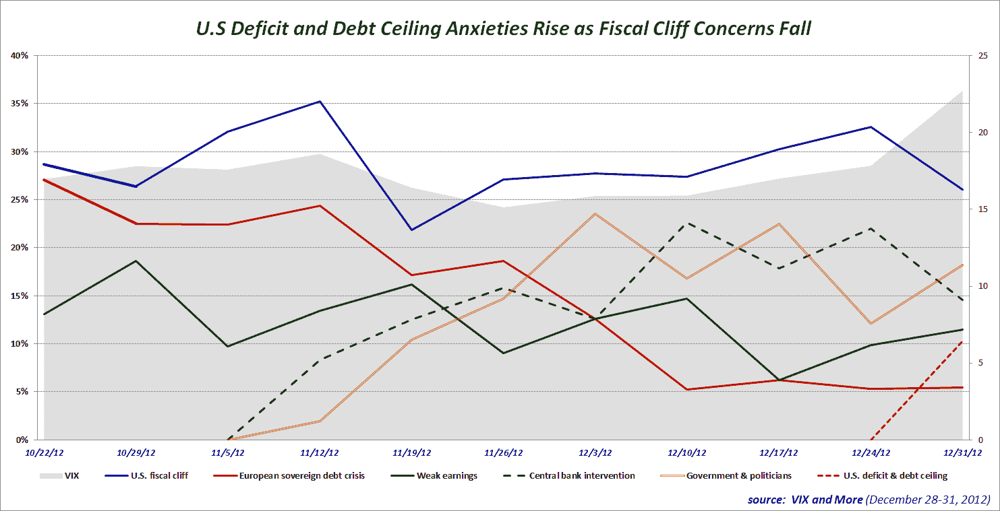

<!--yml

category: 未分类

date: 2024-05-18 16:19:57

-->

# VIX and More: Just a Change of Venue? (Fears About U.S. Deficit/Debt Ceiling Replacing Fiscal Cliff Worries)

> 来源：[`vixandmore.blogspot.com/2012/12/just-change-of-venue-fears-about-us.html#0001-01-01`](http://vixandmore.blogspot.com/2012/12/just-change-of-venue-fears-about-us.html#0001-01-01)

随着美国 [财政悬崖](http://vixandmore.blogspot.com/search/label/fiscal%20cliff) 谈判临近尾声，不足为奇的是，与财政悬崖有关的恐惧连续第十一周位列 *VIX and More* 每周 [恐惧调查](http://vixandmore.blogspot.com/search/label/Fear%20poll) 中对股市的威胁名单的首位。与政府和政治家以及过度的中央银行干预有关的恐惧分别排在第二和第三位。

我特别感兴趣的是与美国赤字和债务上升有关的突然恐惧，因为投资者似乎得出结论，目前的财政悬崖谈判只是民主党和共和党之间持续战争中的又一次冲突，涉及如何解决美国预算赤字的问题。随着财政部长蒂莫西·盖特纳 [表示](http://money.cnn.com/2012/12/26/news/economy/debt-ceiling/index.html) 美国将在今天达到其债务上限，并不得不采取非常手段来保持在法定限额以下，下一场大战已经拉开序幕，当这些非常手段无法再发挥作用时，大约在两个月内。

所以财政悬崖交易将解决什么问题？这个问题的部分答案取决于即将（我们希望）达成的交易是否仅仅是一个权宜之计，还是以全面的方式解决了一些与预算赤字相关的更为政治敏感的根本问题。当然，诀窍在于以一种限制对经济产生任何负面影响的方式构建交易。

敬请关注。财政悬崖交易可能只是信号性的变化，将投资者的恐惧转移到下一个战场。

再次感谢所有参与本周投票的人。

相关帖子：

***Disclosure(s):*** *none*
