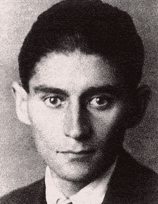

<!--yml

分类：未分类

日期：2024-05-18 17:29:31

-->

# VIX 和更多：卡夫卡、超现实主义与交易

> 来源：[`vixandmore.blogspot.com/2009/09/kafka-surrealism-and-trading.html#0001-01-01`](http://vixandmore.blogspot.com/2009/09/kafka-surrealism-and-trading.html#0001-01-01)

 今天是有一些很有趣的故事正在发生，但考虑到读者可以在其他地方找到它们的大部分，我想我可能会关注一个许多读者可能错过的故事，我认为这对短线交易者和长期投资者来说都是极好的素材。

**Science Daily**网站今天发表了一篇发人深省的的文章，标题引人入胜：[阅读卡夫卡能改善学习，心理学研究建议](http://www.sciencedaily.com/releases/2009/09/090915174455.htm)。该文章总结了 Travis Proulx 和 Steven J. Heine 的研究成果，他们的论文《卡夫卡的联系：暴露于意义威胁中的人工语法学习的显性改进》计划发表在《心理科学》杂志 9 月的版面上。

Science Daily 准确地捕捉了研究发现的本质，如下所述：

> **“当你的暴露于一个意义威胁中——一些根本无法理解的东西——你的大脑会通过寻找你环境中的其他某种结构来做出反应，”UCSB 的博士后研究员、文章的共同作者 Travis Proulx 说。“结果是，这种结构可以与意义威胁完全无关。”*

**Proulx 和 Heine 的研究表明，阅读了荒谬、无意义或超现实主义文学的受试者在之后的模式识别技能测试中表现远优于阅读了容易理解的类似材料的对照组受试者。

那么…这如何适用于交易呢？我将扩展 Proulx 和 Heine 得出的一些相当狭窄的结论，并建议交易员/投资者需要更经常地走出他们的舒适区。他们需要去了解他们不熟悉的新的资产类别、新的市场、新的交易工具、新的基本面信息、新的图表模式等。也许他们甚至应该从舒适的莫扎特和莫奈的领域走向勋伯格和达利的领域。

不断挑战自我，不要担心新的路径一开始看起来混乱。你越是从舒适区出来，这个区域就越开始扩大，你识别这个区域中的重要模式和机会的能力也会越强。
