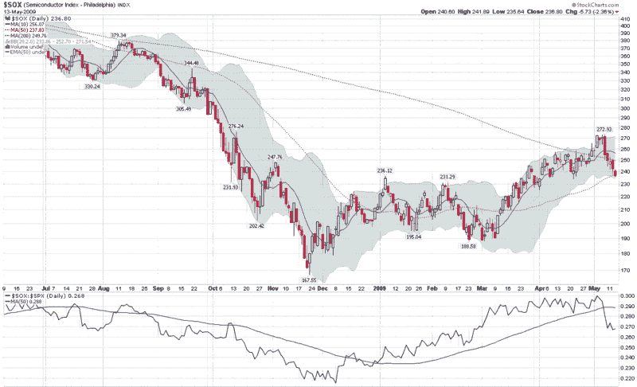

<!--yml

分类：未分类

日期：2024-05-18 17:47:36

-->

# VIX and More: 落后半导体指数暗示谨慎

> 来源：[`vixandmore.blogspot.com/2009/05/lagging-semiconductor-index-suggests.html#0001-01-01`](http://vixandmore.blogspot.com/2009/05/lagging-semiconductor-index-suggests.html#0001-01-01)

上周三，纳斯达克 100 指数（[NDX](http://vixandmore.blogspot.com/search/label/NDX)）相对于标普 500 指数表现较弱，触及高点并开始下跌。NDX 的弱势是我公开质疑[SPX 915 是否已到顶？](http://vixandmore.blogspot.com/2009/05/spx-915-as-top.html)的原因之一——结果发现我确实找到了一个顶部，但这个顶部在 NDX，而不是标普 500。

周四，费城半导体指数（也称[SOX](http://vixandmore.blogspot.com/search/label/SOX)）在触及自身高点后逆转并急剧下跌。SOX 当日收盘下跌 5.6%，并拖累了 NDX 和整个科技板块。自 SOX 大幅下跌以来，科技股一直处于下滑状态。

银行在上周五成功地将市场保持在大牛市状态，没有 SOX 和科技股的帮助（参见[银行对比科技](http://vixandmore.blogspot.com/2009/05/banks-vs-technology.html)），但自周一以来，科技股的弱势开始蔓延到其他板块，甚至是金融股。

科技股的 SOX 指数长期以来被认为是领先指标，不仅对科技股，对整个市场也是如此。半导体股是早期周期的科技股，一个不健康的半导体行业对经济复苏并不利。

展望未来，健康的反弹应该包括半导体的参与，如 SOX 和 ETF 如[SMH](http://vixandmore.blogspot.com/search/label/SMH)所衡量。在理想的反弹中，半导体应显示出强劲的绝对收益，并在相对基础上超越标普 500。除非我们看到半导体有更多的强势表现，否则我可能会有看跌倾向。

来源：[StockCharts]
