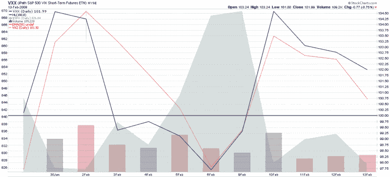

<!--yml

category: 未分类

date: 2024-05-18 17:59:54

-->

# VIX and More: Last Trading Day for VIX February Options. Try VXX Instead?

> 来源：[`vixandmore.blogspot.com/2009/02/last-trading-day-for-vix-february.html#0001-01-01`](http://vixandmore.blogspot.com/2009/02/last-trading-day-for-vix-february.html#0001-01-01)

由于今晨欧洲及欧洲金融机构面临压力，而 SPX 期货在开盘前十分钟下跌了超过 3%，投资者今天可能会寻找一些组合保护。

通常，我会在这里考虑[VIX 期权](http://vixandmore.blogspot.com/search/label/VIX%20options)，但既然今天是二月 VIX 期权的最后交易日（这些期权明天开盘时到期），而三月期权不会提供同样的波动性，这可能是一个考虑[VXX](http://vixandmore.blogspot.com/search/label/VXX)的好时机，这是一个基于[VIX 期货](http://vixandmore.blogspot.com/search/label/VIX%20futures)的短期[VIX ETN](http://vixandmore.blogspot.com/search/label/VIX%20ETN)。

VXX 至今并没有太多的历史记录，但其走势大约是现金/现货 VIX 速度的 75%。如果 SPX 今天下跌了 3%以上，我预计 VXX 会在大约 10%的范围内上涨。

此外，今天应该是一个观察 VXX 成交量是否能为市场情绪提供线索的好日子。最终，VXX 成交量的峰值应该会提供一些看涨的反向市场情绪线索，但目前还为时尚早，还不能完全准确地解读这些信息。

**

*[source: StockCharts]*
