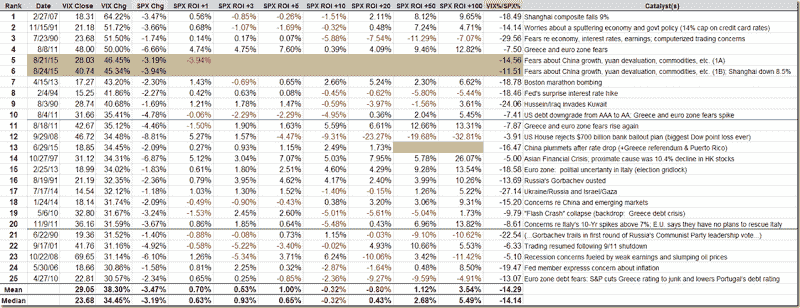

<!--yml

分类：未分类

日期：2024-05-18 16:09:05

-->

# [VIX and More：过去两天是历史上第五和第六大的单日 VIX 飙升](http://vixandmore.blogspot.com/2015/08/last-two-days-are-5-and-6-one-day-vix.html#0001-01-01)

> 来源：[`vixandmore.blogspot.com/2015/08/last-two-days-are-5-and-6-one-day-vix.html#0001-01-01`](http://vixandmore.blogspot.com/2015/08/last-two-days-are-5-and-6-one-day-vix.html#0001-01-01)

许多读者评论说，我经常发布的图表之一是我在这个空间定期更新的 30%或更高 VIX 飙升的表格，以及这些飙升后标准普尔 500 指数的表现。

这一次，我决定添加一个额外的列，标识每个实例中涉及的催化剂（必然是一个主观的过程）。在思考这些催化剂时，将威胁的性质和 VIX 飙升的大小与各种高调历史事件中的波动性变化进行比较可能会有所帮助，我在 [危机期间的波动性](http://vixandmore.blogspot.com/2012/12/volatility-during-crises.html) 分析中捕捉到了这一点。另一个有用的练习是思考在 [波动性事件的概念框架](http://vixandmore.blogspot.com/2008/10/conceptual-framework-for-volatility.html) 的背景下影响每个 VIX 飙升的基本因素，我发现这特别有助于衡量某一类型事件可能引发的 VIX 飙升有多大。

当然，下表中还有其自己的一系列数据要点，既有基本的也有技术性的。我发现值得强调的一个有趣的统计数据是过去五年中大型 VIX 飙升的相对高频率。VIX 数据可追溯到 26 年前，但是这个表格数据中一半以上的 VIX 飙升都发生在过去五年。我认为这并非巧合，[VIX ETPs](http://vixandmore.blogspot.com/search/label/VIX%20ETN)（最初是[VXX](http://vixandmore.blogspot.com/search/label/VXX) 和 [VXZ](http://vixandmore.blogspot.com/search/label/VXZ)）是在 2009 年推出的，而反向 VIX ETPs（[XIV](http://vixandmore.blogspot.com/search/label/XIV) 和 [ZIV](http://vixandmore.blogspot.com/search/label/ZIV)）以及杠杆 VIX ETPs（从[TVIX](http://vixandmore.blogspot.com/search/label/TVIX) 开始）是在随后的一年推出的，当时大型 VIX 飙升突然变得更为普遍——远比[2008](http://vixandmore.blogspot.com/search/label/2008)年金融危机、互联网泡沫破裂等时期更普遍。有关在总体波动性环境更低的情况下发生更多 VIX 飙升的更多信息，请查看[2014 年 VIX 飙升次数排名第三](http://vixandmore.blogspot.com/2015/01/2014-had-third-highest-number-of-20-vix.html)。

](http://lh3.googleusercontent.com/-KcJyImzmfYA/VduR8bjD7SI/AAAAAAAAJkw/KToY9Jl2fMs/s1600-h/History%252520of%25252030%252520pct%252520VIX%252520Spikes%252520w%252520Catalysts%252520082415%25255B4%25255D.png)

数据来源：[CBOE, VIX and More]

如前所述，根据所有超过 30%的 VIX 跳升的数据，SPX 在 VIX 跳升后的 1、3 和 5 日期间往往表现优于其长期平均水平。同样值得注意的是，在 VIX 跳升后的 10 和 20 日，SPX 不仅表现不佳，而且倾向于下跌。此外，尽管 2008 年 9 月 29 日 VIX 跳升之后的大幅下跌往往使其他数据点相形见绌，但即使去掉了 2008 年 9 月 29 日的 VIX 跳升，SPX 在 VIX 跳升后的 10 和 20 日期间仍然亏损。当分析延长到 50 个交易日，SPX 回到盈利状态，但表现仍低于其长期平均水平。另一方面，当分析包括 VIX 跳升后的 100 天，SPX 回到表现优于其长期平均水平。

总结来说，数据显示在 30%的一日 VIX 跳升之后，通常会出现大约持续一周的可交易的超卖状况，随后市场通常需要一个月左右的时间来应对对股票的威胁。这种倾向使得今天的市场行为更加引人注目，因为今天是在 30%的 VIX 跳升之后 SPX 表现最差的一天。

从更长的视角来看，至少看一个季度，所有的恐惧通常都已成为过去，股票很可能已经取得了显著的涨幅。

如在这里过去多次提到的，表中的数据支持短期和长期[均值回归](http://vixandmore.blogspot.com/search/label/mean%20reversion)的想法，但质疑均值回归在 VIX 跳升后的 10-20 天内的作用，此时基本面因素倾向于压倒技术上超卖的股票状况。

相关文章：

***披露(s):*** *在撰写本文时持有 VIX 空头仓位；CBOE 是 VIX and More 的广告商*
