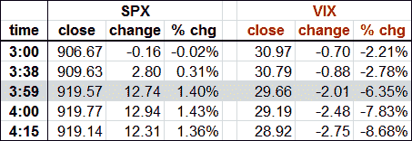

<!--yml

分类：未分类

日期：2024-05-18 17:45:26

-->

# VIX and More：晚间上涨，SPX 和 VIX

> 来源：[`vixandmore.blogspot.com/2009/05/late-day-rallies-spx-and-vix.html#0001-01-01`](http://vixandmore.blogspot.com/2009/05/late-day-rallies-spx-and-vix.html#0001-01-01)

今天是一个有趣的交易日，尤其是在股票交易的最后一个小时。

底部的图形记录了（太平洋时间）VIX 的日内波动，除了交易开始的第一个小时和最后 22 分钟外，基本保持平稳。在东部时间下午 3:00，VIX 为 30.97，比昨日收盘价下跌 0.70（-2.21%）。此时，SPX 为 906.67，比当天下跌 0.16（-0.02%）。

SPX 在交易最后一个小时开始缓慢而稳定地上升，VIX 逐渐回落。下表记录了那最后一个小时 VIX 和 SPX 的变化。请注意，VIX 的值每 15 秒更新一次，在下午 3:38 开始急剧变动，然后在下午 3:41 创建了几个间隙中的第一个。到下午 3:59，即纽约证券交易所关闭前一分钟，VIX 已经以相反方向的方式移动了大约 SPX 百分比变化的 4.5 倍。下午 4:00，构成 SPX 的股票停止交易。SPX 的日最高点 920.02 记录在钟声响起后的那一分钟，因为一些交易数据在收市后缓慢涌入。在收盘后的两分钟内，SPX 被多次以小幅度调低，最终在下午 4:11 定稿。

尽管 SPX 的各个组成部分在下午 4:00 停止交易，但 SPX 指数期权在我所谓的额外 15 分钟内继续交易

[黄昏区](http://vixandmore.blogspot.com/search/label/twilight%20zone)

交易时段。如果标普 500 指数在常规交易时段结束时出现强劲走势，或者在 15 分钟的黄昏区间内出现重要新闻，这可能会导致一些有趣的 VIX 数据打印。今天显然发生的情况是，标普 500 指数期权的供应在常规交易时段的最后几分钟超过了需求，并延续到了指数期权交易的 15 分钟。到东部时间下午 4:15，当 VIX 最终确定时，它已经下跌到 28.92，这一变动是 SPX 百分比变化的 6.4 倍，方向相反。

通常情况下，当人们看到波动率指数 VIX 与标普 500 指数 SPX 百分比变动比例发生显著变化时，这表明 SPX 期权的供需方程出现了实质性的不平衡。

顺便提一句，那些分析历史 VIX 和 SPX 数据的人应该注意，不同的截止时间有时会导致一些异常数据异常。

获取更多信息，请查看一月份有关此主题的相关帖子：

[VIX（和 VXN）之后的交易时间](http://vixandmore.blogspot.com/2009/01/vix-and-vxn-after-hours.html)

。

*[来源：thinkorswim]*
