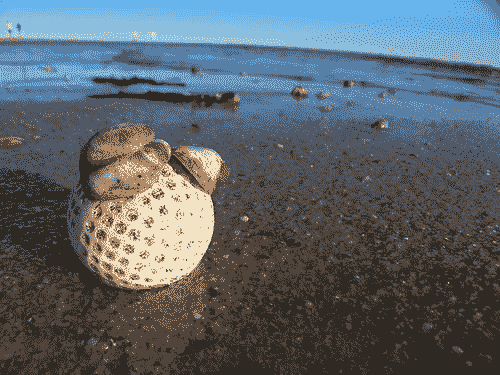

<!--yml

分类：未分类

日期：2024-05-18 19:04:45

-->

# VIX and More: 链接：放置位置

> 来源：[`vixandmore.blogspot.com/2007/07/links-play-it-where-it-lies.html#0001-01-01`](http://vixandmore.blogspot.com/2007/07/links-play-it-where-it-lies.html#0001-01-01)

自我上次发布链接集以来，已经过去**几乎一个月**了：[点击此处](http://vixandmore.blogspot.com/2007/07/dow-13600-links.html)。因此，我将稍微弯曲一下规则，以包含过去三周左右我认为具有相当持久价值且对我个人档案重要的显著帖子。在这场游戏的现阶段，大部分都不是突发新闻，但这些链接仍然应该为深思熟虑提供一些极好的素材。

展望未来，如果您正在寻找一组链接，以获得几乎实时的投资界谁在思考什么的快照，我强烈建议您查看由

**Abnormal Returns**](http://abnormalreturns.com/)

和 Barry Ritholtz 在

**The Big Picture**](http://bigpicture.typepad.com/)

.

杂乱无章地列出：
