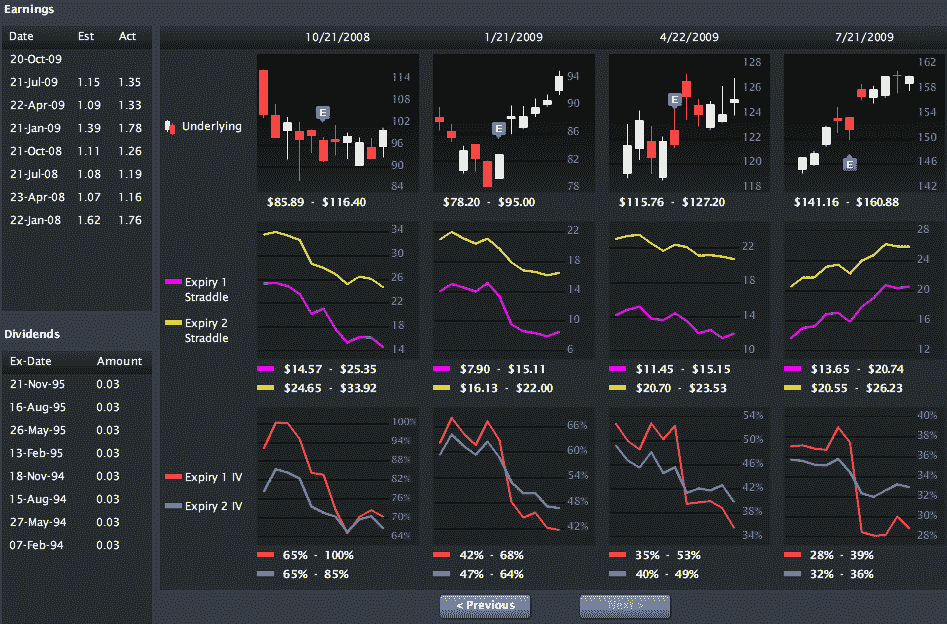

<!--yml

分类：未分类

日期：2024-05-18 17:29:52

删除线

# VIX 和更多：Livevol Pro：一套世界级的波动率工具

> 来源：[`vixandmore.blogspot.com/2009/09/livevol-pro-world-class-suite-of.html#0001-01-01`](http://vixandmore.blogspot.com/2009/09/livevol-pro-world-class-suite-of.html#0001-01-01)

长期读者都知道，在[隐含](http://vixandmore.blogspot.com/search/label/implied%20volatility)波动率和[历史](http://vixandmore.blogspot.com/search/label/historical%20volatility)波动率的图表方面，我更倾向于使用来自[国际证券交易所](http://www.ise.com/WebForm/md_livevol.aspx?categoryId=124&header2=true&menu1=true)（ISE）和[iVolatility.com](http://www.ivolatility.com/options.j?ticker=SPX:CBOE&R=1&period=12&chart=2&vct=)的免费图表。事实上，当我大约 1 年半前开始定期使用[ISE 隐含波动率图表](http://vixandmore.blogspot.com/2008/03/ise-implied-volatility-charts.html)时，我简直被读者关于如何创建自己图表的信息请求淹没了。

去年 11 月，我在[国际证券交易所更新隐含波动率图表](http://vixandmore.blogspot.com/2008/11/international-securities-exchange.html)一文中记录了 ISE 图表的一些改进，并最终将这些图表评为首届[VIX 和更多](http://vixandmore.blogspot.com/2009/01/2008-volatility-awards.html) [2008 波动率奖](http://vixandmore.blogspot.com/2009/01/2008-volatility-awards.html)中的*最佳新免费波动率工具*。

我之所以提这些，是因为开发 ISE 波动率图表的公司，[Livevol](http://www.livevol.com/)，最近发布了一套新的期权工具，这现在成为了我在波动率和期权分析方面的个人最爱。名为[Livevol Pro](http://www.livevol.com/RealtimeAnalysis.aspx)的网络应用程序是由专业交易员为专业和零售投资者开发的。

我很高兴有机会花几周时间测试 beta 版本，并很高兴看到 Livevol Pro 本周走出 beta 版。如果你对波动率感兴趣，至少你应该查看一下[5 分钟演示视频](http://www.livevolpro.com/help/movies/all_movie_short/all_movie_short.html)或更详细的[完整功能演示](http://www.livevolpro.com/help/movies/all_movie/all_movie.html)，看看产品能提供什么。我最喜欢的功能包括：

+   一个公司选项卡，显示所选公司/ETF/指数的全面期权数据概览，包括：与过去 52 周数据相比的隐含波动率和历史波动率百分位数排名；在要价买入和在买入价卖出的看涨和看跌交易百分比；以及更多内容

+   一个期权选项卡，显示实时流式期权报价和隐含波动率数据——快速过渡到内置期权图表的水平 II 报价

+   期权的时间和销售数据，可以根据执行价格、交易大小、交易所和日期进行筛选。其中包括了两年的历史期权时间和销售交易数据。

+   一个带有 22 个内置筛选器的强大扫描工具，包括多种切分和分析隐含波动率的方式，比较 IV 和 HV，跟踪订单流（成交量、持仓量、ISE 情绪），标记重要的价格变化，并揭示一些有趣的时差价差设置。

+   最后是一个实用的财报工具，提供了两年关于财报发布前后标的资产价格和隐含波动率变化的视觉历史。在下面的屏幕截图中，你可以看到每个财报期间包括财报发布前后的五天。图表在最上面一排跟踪标的资产([APPL](http://vixandmore.blogspot.com/search/label/APPL)在这个实例中)的价格变化，中间一排是当前月和下两个月 straddle 头寸的价值变化，最下面一排是当前月和下两个月隐含波动率的变化。

我将在接下来的内容中展示一些 Livevol Pro 的图表和内容，但我想先告知读者们关于这个应用软件，现在它已经上线并对公众开放了。谈到期权，每个人都有自己认为重要的信息，但对于我来说，Livevol Pro 集成了我想要的一切，全部集中在一个地方，而且每月只需$100。

对于那些可能感兴趣的人来说，Livevol 还有一个[免费版本](http://www.livevol.com/SignUpLanding.aspx)的应用程序，提供收盘后的日终数据更新。

更多信息，读者可以访问[`www.livevol.com`](http://www.livevol.com/)。

*[图表：Livevol Pro]*
