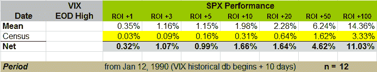

<!--yml

分类：未分类

日期：2024 年 05 月 18 日 18:24:12

-->

# VIX and More：在新的 VIX 记录收盘时做多 SPX

> 来源：[`vixandmore.blogspot.com/2008/09/long-spx-on-new-vix-record-closes.html#0001-01-01`](http://vixandmore.blogspot.com/2008/09/long-spx-on-new-vix-record-closes.html#0001-01-01)

鉴于昨天 VIX 的创纪录收盘，一位读者询问了如果在 VIX 创下新高时买入市场的历史记录。

首先，让我们详细了解 VIX 新的收盘高点的历史。逆向工作，最近的五个新高出现在 1998 年 8 月 27 日至 10 月 8 日期间，当时[俄罗斯金融危机](http://vixandmore.blogspot.com/search/label/Russian%20financial%20crisis)演变为[长期资本管理公司](http://vixandmore.blogspot.com/search/label/Long%20Term%20Capital%20Management)危机。1998 年之前，最近的 VIX 高点来自 1997 年 10 月 30 日，当时是[亚洲金融危机](http://vixandmore.blogspot.com/search/label/Asian%20financial%20crisis)。

查看芝加哥期权交易所(CBOE)的历史数据库，该数据库可以追溯到 1990 年初，接下来的三个 VIX 高点是 1990 年 8 月。在回到 8 月高点之前，1990 年 1 月有 11 个高点，其中包括前十个交易日中的八个。在下图中，我省略了首个月 VIX 数据的前十个交易日的噪音，并且仅包括了该初始月份的最后三个 VIX 高点。尽管这只留下了十个数据点，但模式是明确的：当 VIX 创下新高时，做多 SPX 是一种有效的策略，至少在持有期为 1 至 100 天时是这样。例如，VIX 高点后十天，SPX 的平均回报约为 2%，而过去 19 年中所有十天期间的 SPX 的平均回报仅为 0.3%。

对于昨天的 34.5%可能与一些额外的均值回归数据相关

[VIX 飙升](http://vixandmore.blogspot.com/search/label/VIX%20spikes)

，查看以前的帖子，

[VIX 一日 30%（！）飙升](http://vixandmore.blogspot.com/2007/02/one-day-30-spikes-in-vix.html)

.
