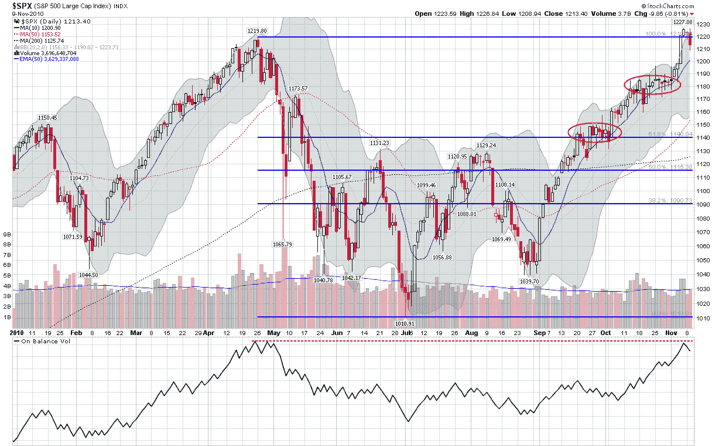

<!--yml

类别：未分类

日期：2024-05-18 16:59:07

-->

# VIX 与更多：寻找 SPX 支撑水平

> 来源：[`vixandmore.blogspot.com/2010/11/looking-for-spx-support-levels.html#0001-01-01`](http://vixandmore.blogspot.com/2010/11/looking-for-spx-support-levels.html#0001-01-01)

在上周五刚刚达到 1227 点的新两年高点后，标普 500 指数本周开始显示出一些脆弱的迹象，从该高点下跌了 1.5%，至今天的 1208 点水平。

我一般认为，回撤只有当从高点到低谷跨越至少 3%时才具有意义，因此假设牛市不会继续推动股票日复一日地走高，考虑一下 SPX 可能有什么样的支撑是值得的。

现在首先支撑的候选点位是今天的 SPX 1208 点的低点。在那之后，心理上重要的 1200 点关口显得很重要，特别是它还充当了指数飙升到新高的最后一个基准。在 1200 点以下，寻找支撑并不容易。

下图突出显示了两个用红色椭圆标记的拥挤区域。较高的一个由 1175-1185 点界定，在股票在此之前约三周的时间内进行了整理。较低的拥挤区域位于 1140-1150 点范围内，正好在一个关键的斐波那契支撑水平上方，反映了 9 月下半月的区间交易。在图表的这个区域以下，我们遇到了从 5 月到 9 月的交易范围内的 1130 点及以下的残余支撑水平。

3%的回撤会使 SPX 回落到约 1190 点，因此我预计 1175-1185 点将是一个关键的支撑水平，也许是一个轻微回撤和熊市反弹的分界线。当然，自 8 月份以来，熊市一直没有能够凝聚出任何熊市动能。但考虑到 SPX 在此期间几乎没有间断地上涨了 187 点（18%），下一次下跌可能是急剧的，这种可能性不能忽视。

那些担心双顶可能性的人也应该考虑到，平衡成交量指标也指向了双顶的可能性。最后，随着 VIX 在低 19 区间，VIX 看涨期权在这个关头可以提供相对廉价的投资组合保险，以防牛市开始有所犹豫。

相关文章：

***披露：*** *无*

**[来源：StockCharts.com]**
