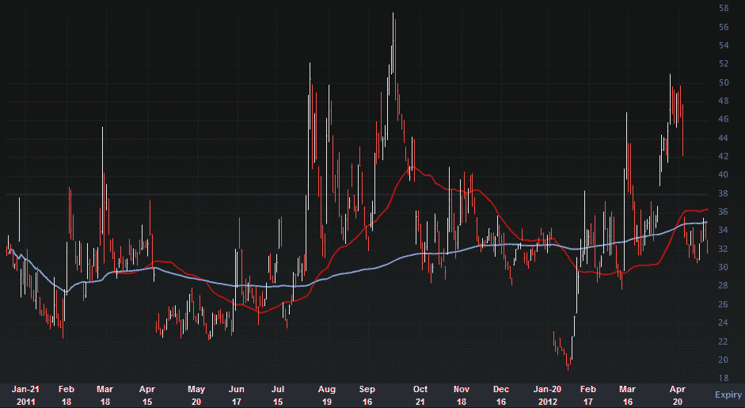

→

分类：未分类

日期：2024-05-18 16:30:43

→

# VIX 和更多：看起来苹果 VIX (VXAPL) 期货即将推出

> 来源：[`vixandmore.blogspot.com/2012/05/looks-like-apple-vix-vxapl-futures-are.html#0001-01-01`](http://vixandmore.blogspot.com/2012/05/looks-like-apple-vix-vxapl-futures-are.html#0001-01-01)

以防有人错过了，我想强调的是，昨天路透社发表了一篇[报告](http://www.reuters.com/article/2012/05/09/cboe-apple-idUSL1E8G9COO20120509)，引用了 CBOE 控股公司总裁 Edward Tilly 的话，他说 VIX 产品线不仅适合扩展，而且：

> “我们在许多其他产品上都有基准。我想指出的是，有一个我非常喜欢的产品，我不会惊讶如果我很快看到我们推出 - 苹果 VIX 的期货。”

苹果 VIX([VXAPL](http://vixandmore.blogspot.com/search/label/VXAPL))于 2011 年 1 月推出，与此同时还推出了类似单一股票波动指数的产品，包括：

苹果 VIX 期货的成功推出可能会为其他单一股票波动指数之一或多个期货打开大门。

下图，由 Livevol *（StockCharts.com，你真的应该在数据库中有 VXAPL）* 提供，显示 VXAPL 通常保持在 35 左右的中间位置，但在其前 17 个月的生命周期中，其范围在 20 的高位到 50 的高位之间。

回想一下，CBOE 期货交易所(CFE)于 2011 年 12 月[推出](http://vixandmore.blogspot.com/2011/12/cboe-to-launch-futures-on-emerging.html)新兴市场波动指数([VXEEM](http://vixandmore.blogspot.com/search/label/VXEEM))期货，并于 2012 年 1 月底[推出](http://vixandmore.blogspot.com/2012/01/cboe-adds-options-to-emerging-markets.html)VXEEM 期权。CFE 还于 2 月 21 日推出基于[VXEWZ](http://vixandmore.blogspot.com/search/label/VXEWZ)（基于[EWZ](http://vixandmore.blogspot.com/search/label/EWZ)的 CBOE 巴西 ETF 波动指数）的期货，并于 3 月 6 日为 VXEWZ 添加期权。

如果你喜欢交易波动产品，看起来我们可能正进入黄金时代的收缩型波动指数，这可以作为期货、期权甚至交易所交易产品的产品平台。如果你认为基于 VIX 的 ETP 很有趣，那就等着看基于 VXAPL 的 ETP 推出吧。当然，如果对期货和期权的需求不够大，这些 ETP 中的一些可能永远看不到光明，所以早期采用者，不要害怕出价。

最后，稍微跑题一点，我认为我收到的关于[卖苹果看跌期权案例](http://vixandmore.blogspot.com/2012/04/case-for-selling-apple-puts.html)的邮件比 VIX 和更多博客历史上任何其他帖子都要多。对于所有写了邮件的人，包括那些选择卖苹果([AAPL](http://vixandmore.blogspot.com/search/label/AAPL))看跌期权的人，当前的环境可能适合重新审视这种交易策略。

相关文章：

来源：[LivevolPro.com]

**披露声明：** 写作时持有 AAPL 多头仓位；Livevol 和 CBOE 是 VIX and More 的广告商。
