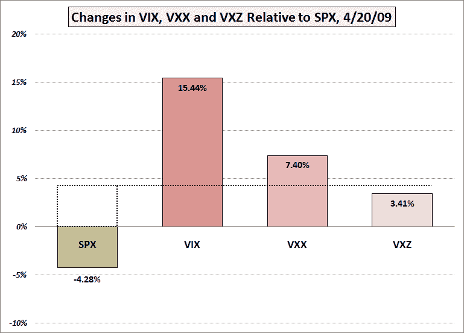

→yml

分类：未分类

日期：2024-05-18 17:51:02

→

# VIX and More: Lost in Translation: VXX and VXZ

> 来源：[`vixandmore.blogspot.com/2009/04/lost-in-translation-vxx-and-vxz.html#0001-01-01`](http://vixandmore.blogspot.com/2009/04/lost-in-translation-vxx-and-vxz.html#0001-01-01)

部分基于我上周在一些文章中提出的思考[《一些 VIX 里程碑…以及一个预测》](http://vixandmore.blogspot.com/2009/04/some-vix-milestonesand-prediction.html)，我很幸运地在昨天的交易前持有了[VXX](http://vixandmore.blogspot.com/search/label/VXX)，iPath S&P 500 VIX Short-Term Futures ETN。

VXX 一日上涨 7.40%，但这个涨幅不到 VIX 的 15.44%的一半。另一方面，[VXZ](http://vixandmore.blogspot.com/search/label/VXZ)，iPath S&P 500 VIX Mid-Term Futures ETN，其目标是在五个月左右的 VIX 期货，仅仅上涨了 3.41%，不到 VXZ 的一半。如下图所示，VXZ 的上涨甚至没有达到 SPX 的 4.28%的下跌。

综合考虑，这些都是相对于 VIX 应该期望的百分比波动。我之前在[VXX 数据现在描绘出准确的图片](http://vixandmore.blogspot.com/2009/03/vxx-data-now-painting-accurate-picture.html)和其他地方讨论过相对的[juice factor](http://vixandmore.blogspot.com/search/label/VXX%20juice%20factor)，但显然还没有人完全理解这些信息。此外，如果你关注这里的任何[期限结构](http://vixandmore.blogspot.com/search/label/term%20structure)讨论，随着未来几个月的推移，波动性预测是一个反复出现的主题。

在几乎三个月的数据基础上，VXX 现在平均每天 VIX 的 50%左右的波动，而 VXZ 则平均每天 VIX 的 20%左右。底线是，如果你想要现金 VIX 产生的那种波动，你的最佳选择是[VIX 期权](http://vixandmore.blogspot.com/search/label/VIX%20options)，VIX 期货或者 VXX 的 2 倍杠杆玩法。

个人认为，考虑到它们的流动性和构建各种期权头寸的灵活性，VIX 期权通常是最吸引人的交易 VIX 的方式。

*[图表：VIXandMore]*

****披露****：在撰写本文时持有 VXX。**
