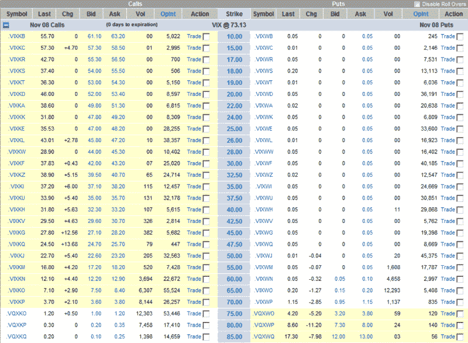

<!--yml

分类：未分类

日期：2024-05-18 18:15:39

-->

# 波动率指数（VIX）及相关话题：波动率指数（VIX）11 月期权的最后交易日内仍有大量期权溢价

> 来源：[`vixandmore.blogspot.com/2008/11/lots-of-premium-left-on-last-day-of.html#0001-01-01`](http://vixandmore.blogspot.com/2008/11/lots-of-premium-left-on-last-day-of.html#0001-01-01)

[VIX 期权](http://vixandmore.blogspot.com/search/label/VIX%20options) 明天早上将到期，在[VIX 特别开盘报价](http://vixandmore.blogspot.com/search/label/VIX%20SOQ) (SOQ)中，今天只剩下不到一个小时的交易时间，VIX 看涨期权（November 75 calls）仍几乎处于两美元的虚值，当前交易价格为 1.20，表明交易者认为市场状况在最后一小时可能恶化，或者在明天开盘时因更多不利消息而大幅下跌的可能性很大。

下面的图表，由 optionsXpress 提供，展示了 VIX November options 的价格直至 85 行权价，快照于东部时间下午 2:52，当时 VIX 为 73.13：

来源：[optionsXpress]
