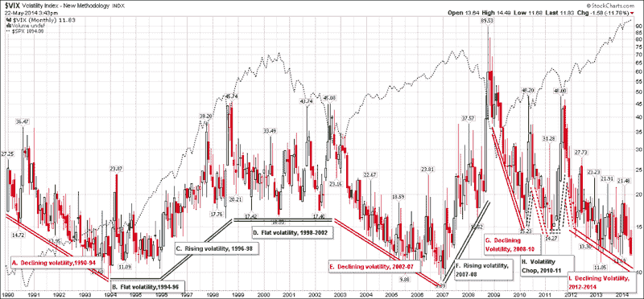

<!--yml

类别：未分类

日期：2024-05-18 16:10:29

-->

# VIX and More: 低波动率：如何从平静的 VIX 中获利（在《巴伦周刊》的客座专栏作家）

> 来源：[`vixandmore.blogspot.com/2014/05/low-volatility-how-to-profit-from-quiet.html#0001-01-01`](http://vixandmore.blogspot.com/2014/05/low-volatility-how-to-profit-from-quiet.html#0001-01-01)

今天我再次成为《巴伦周刊》的客座专栏作家，为尊敬的《巴伦周刊》期权专栏[The Striking Price](http://online.barrons.com/public/search/results.html?HEADER_TEXT=The%20Striking%20Price%20Daily&article-doc-type=%7bThe+Striking+Price+Daily%7d&mod=BOL_article_full_more)撰写了[低波动率：如何从平静的 VIX 中获利](http://online.barrons.com/news/articles/SB50001424053111904554304579577934289682884)一文。尽管这是我第 13 次作为客座专栏作家，但让我惊讶的是这是“VIX”第一次出现在标题中。由于每个人似乎都在谈论 VIX 有多低，VIX 是否破裂等问题，我认为分享我对这个话题的一些想法是合适的。

在《巴伦周刊》的文章中，我提出了这样一个观点：尽管在[VIX 激增](http://vixandmore.blogspot.com/search/label/VIX%20spikes)时进行[均值回归](http://vixandmore.blogspot.com/search/label/mean%20reversion)交易是一个可行的策略，但当 VIX 大幅低于其长期均值（恰好超过 20）时，均值回归方法的效果要差得多。

下图（VIX 的月度柱状图）显示，大部分显著的 VIX 激增都是短暂的，但 VIX 可以在多年的时间里一直保持在 20 水平以下。看看 1994 – 1996 年和 2004 – 2007 年，想想在类似这样的时期，凭借 knowledge that *eventually* the VIX will have to revert to its historical mean，购买 VIX 看涨期权或建立一个类似的长期波动性头寸是否具有可行性。

](http://lh3.ggpht.com/-PlmYzYFH7Q0/U35dfPXwCZI/AAAAAAAAIx4/YrKJlRI23Jc/s1600-h/VIX%252520Macro%252520Cycles%2525201990-2014%25255B4%25255D.png)

*[来源：StockCharts.com]*

事实上，已经有两个实例（1990 – 1994 年和 2002 -2007 年），在这段时间内 VIX 持续下降了至少四年。考虑到 2011 年 8 月最近的高波动性，认为波动性至少会持续到 2015 年 8 月，并不是不合理的。

虽然《巴伦周刊》的文章没有给我的期权交易想法贴上标签，但它是一个考虑出售 VIX 14 日看跌期权并（或许）将收益投资于两倍的 VIX 17 日看涨期权的[风险反转](http://vixandmore.blogspot.com/search/label/risk%20reversal)比率。

我鼓励大家都去阅读《巴伦周刊》的**[原文文章](http://online.barrons.com/news/articles/SB50001424053111904554304579577934289682884)**，但对于那些可能不会点击进去的人，我将在下面包括我的结尾段落：

> **“无论你的市场前景如何，都不要犯错误，认为 VIX 不再相关，并且当涉及到将低 VIX 等同于自满时，要小心。VIX 收盘价低于 13 的情形出现了 964 次——几乎所有这些情形都发生在牛市的中期。”**

相关文章：

我的《巴伦周刊》贡献完整列表：

+   **低波动性：如何从安静的 VIX 中获利**（2014 年 5 月 22 日）

+   **新兴市场股票：它们触底了吗？**（2014 年 3 月 28 日）

+   **如何早期识别风险**（2013 年 7 月 16 日）

+   **如何为你的股票组合投保**（2013 年 4 月 18 日）

+   **期权交易的理由**（2013 年 1 月 2 日）

+   **冷静下来并利用他人的焦虑**（2012 年 11 月 14 日）

+   **如何在波动事件周围交易期权**（2012 年 7 月 10 日）

+   **在别人恐惧时贪婪**（2012 年 5 月 3 日）

+   **将波动性转化为资产类别的几种方式**（2011 年 1 月 12 日）

+   **在不确定性中寻找机会**（2010 年 11 月 18 日）

+   **市场波动性是否会回到危机水平？**（2010 年 9 月 15 日）

+   **预测波动性的危险**（2010 年 5 月 20 日）

+   **对波动性采取更长的视角**（2009 年 7 月 2 日）

**披露：** 无
