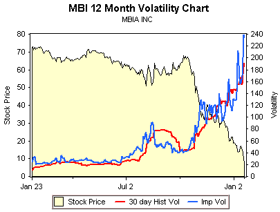

<!--yml

分类：未分类

date: 2024-05-18 18:46:24

-->

# VIX and More: MBI, Bond Insurers, and Volatility

> 来源：[`vixandmore.blogspot.com/2008/01/mbi-bond-insurers-and-volatility.html#0001-01-01`](http://vixandmore.blogspot.com/2008/01/mbi-bond-insurers-and-volatility.html#0001-01-01)

在当前市场困难期间，值得关注的一个比较有趣且重要的剧情是债券保险商的故事。这些债券保险商中最突出的两家，MBIA (MBI)和 Ambac (ABK)，如今正随着报道指出纽约保险 Superintendent 正在尝试安排来自像 Goldman Sachs (GS)、Merrill Lynch (MER)、JPMorgan (JPM)、Citigroup (C) 和 Wachovia (WB) 的[资本注入](http://www.bloomberg.com/apps/news?pid=20601103&sid=akJnQGtVt6uU&refer=us)而成为新闻。 presumably，联邦储备正在幕后施加压力并提供了某些金融激励，因为如果没有解决债券保险商的问题，可能会触发系统性的混乱，并涉及一系列漫长的且昂贵的多米诺骨牌过程。

纽约保险 Superintendent Eric Dinallo 早些时候[被引用](http://www.marketwatch.com/News/Story/Story.aspx?guid=%7b6806DD6D-C4DF-48A6-BB10-47660A9840E5%7d&siteid=yhoo&dist=yhoo)说，虽然迅速解决至关重要，但敲定救助计划的细节可能需要一段时间。"尽快解决与债券保险商相关的问题很重要，"Dinallo 指出，同时警告 "这些问题涉及多方，任何有效的计划都需要一些时间来最终确定。"

虽然大多数投资者应该从债券保险商问题对整个市场的影响来考虑这个问题，但是也有一些关于债券发行者本身的有趣投资策略。如[24/7 Wall Street](http://www.247wallst.com/)所报道，高盛提出了三种不同情况下的[潜在估值](http://www.247wallst.com/2008/01/goldman-sachs-v.html)，范围从债券保险商无法筹集足够的资本来安抚评级机构到所筹集的资本使债券保险商能够继续像危机前那样运营的情况。仅看 MBI，估值范围从 6 美元到 48 美元不等。

投资行为很难比这更具有投机性质了，正如上面来自 optionsXpress 的图表所显示的。记录在案，目前所有二月份的看跌期权都带有超过 200 的隐含波动率。虽然在此我不会推荐具体的交易策略，但对于那些认为高盛的预测和数字大致正确的人来说，有一些非常吸引人的期权价差和[比例价差](http://www.optionsxpress.com/educate/strategies/ratiospreads.aspx)值得关注。
