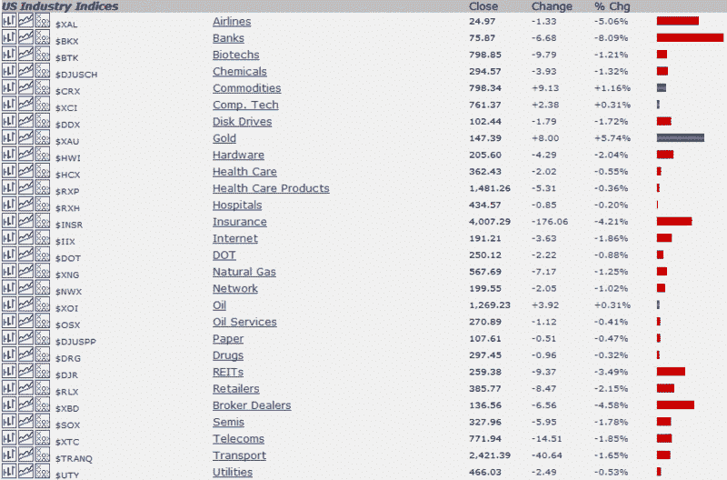

<!--yml

分类：未分类

日期：2024-05-18 18:25:32

-->

# VIX and More: Market 2.0

> 来源：[`vixandmore.blogspot.com/2008/09/market-20.html#0001-01-01`](http://vixandmore.blogspot.com/2008/09/market-20.html#0001-01-01)

到目前为止， Market 2.0 已经进行了 1 ½小时，形势看起来像是回到了年初。黄金、石油和一般商品都在上涨，几乎所有其他板块都在下跌，金融、航空和房地产板块遭受了最大跌幅。

下方的图表来自[StockCharts.com](http://stockcharts.com/)，详细列出了美国[板块](http://vixandmore.blogspot.com/search/label/sectors)在东部时间上午 11:00 前的表现。如果板块表现看起来很熟悉，那可能是因为这些趋势与我在 2008 年 1 月 1 日记录的[2008 年开盘一小时的板块线索](http://vixandmore.blogspot.com/2008/01/sector-clues-in-first-hour-of-2008.html)非常相似。

