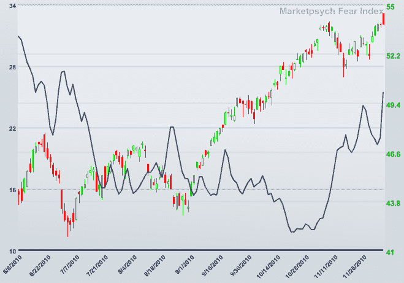

<!--yml

category: 未分类

date: 2024-05-18 16:56:54

-->

# VIX 和更多：市场心理提供了基于语言的恐惧指数

> 来源：[`vixandmore.blogspot.com/2010/12/market-psych-offers-language-based-fear.html#0001-01-01`](http://vixandmore.blogspot.com/2010/12/market-psych-offers-language-based-fear.html#0001-01-01)

除了 VIX 之外，还有相当多的[恐惧](http://vixandmore.blogspot.com/search/label/fear)指数。例如，几个月前，我还颂扬了[圣路易斯联储的金融压力指数](http://vixandmore.blogspot.com/2010/09/st-louis-feds-financial-stress-index.html)的优点。

我还没有看到媒体太多关注的一个更有趣的指数是[市场心理恐惧指数](http://www.marketpsych.com/mkt_analysis.php)。这个指数是通过使用美国金融新闻中“恐惧”词汇的 10 日指数移动平均构建的。在下面的图表中，市场心理恐惧指数是实心蓝线，而蜡烛图是纳斯达克 100 指数([QQQQ](http://vixandmore.blogspot.com/search/label/QQQQ))。

由于这个恐惧指数是基于金融媒体中的语言构建的，因此它使得可以将市场基于的恐惧措施（如 VIX 和其他波动指数）与公众关注程度或媒体中发现的恐惧情绪进行比较。

人们可能会期望市场心理恐惧指数和股票通常会相反地移动，正如 VIX 和股票的情况一样。尽管这通常是这样的情况，但下面的图表显示，在过去的一个月左右，随着股票的上涨，股票和市场心理恐惧指数的运动是正相关的。这意味着什么呢？也许所有关于[欧洲主权债务危机](http://vixandmore.blogspot.com/search/label/European%20sovereign%20debt%20crisis)和朝鲜半岛挑衅的谈论已经开始淡薄。也许媒体不再像过去那样能够激发恐惧。当然，也许奥卡姆剃刀会说投资者太天真了。

无论如何，[VIX 期货](http://vixandmore.blogspot.com/search/label/VIX%20futures)预测到 2011 年年中 VIX 将几乎上涨 50%。

至少，我认为市场基于和语言基于的恐惧指标之间的背离值得进一步关注。

最后，[市场心理网站](http://www.marketpsych.com/)有一些有趣的内容，其中最有趣的是对[股票](http://www.marketpsychadvisor.com/vitalsigns?ticker=C)和[ETFs](http://www.marketpsychadvisor.com/vitalsignssector?ticker=SPY)的情绪分析，以及为交易员和投资者提供的一组[免费性格测试](http://www.marketpsych.com/personality_test.php)。

Related posts:

*[来源：MarketPsych.com]*

***免责声明(s):*** *在撰写本文时通过期权持有 VIX 的中性立场*
