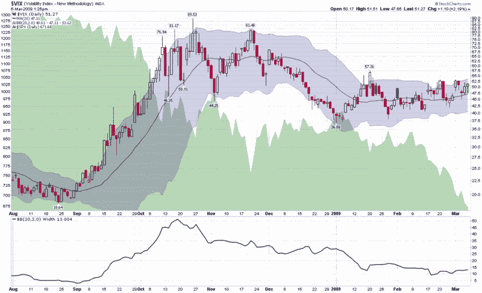

<!--yml

category: 未分类

日期：2024-05-18 17:57:01

-->

# VIX 和更多：市场继续下跌，VIX 相对平稳

> 来源：[`vixandmore.blogspot.com/2009/03/markets-continue-to-fall-vix-relatively.html#0001-01-01`](http://vixandmore.blogspot.com/2009/03/markets-continue-to-fall-vix-relatively.html#0001-01-01)

当谈到 VIX 时，最近大家心里都有一个问题，那就是为什么 VIX 相对平稳——甚至比 10 月和 11 月还要低——而市场却在创多年新低。

这个问题有几种看法。

首先，考虑[历史波动率](http://vixandmore.blogspot.com/search/label/historical%20volatility)。从严格的统计角度来看，SPX 的 20 日历史波动率在 10 月底达到峰值 85，现在约为 41，所以从实际最近波动率的角度来看，VIX 约为 10 月底和 11 月初的高点的一半似乎与最近市场走势相一致。

当然，VIX 反映了[隐含波动率](http://vixandmore.blogspot.com/search/label/implied%20volatility)，而不是历史波动率。隐含波动率包含了不确定性的逐步变化和[恐慌](http://vixandmore.blogspot.com/search/label/fear)情绪，这些都是基于最近的历史波动率之上的。至少这是 conceptualize VIX 的一些组成部分的一个简单方法。合乎逻辑的结论是，VIX 的历史波动率组成部分正在减少，不确定性及其恐惧方面也是如此。

这并不是说当前的经济环境缺乏恐慌和不确定性。然而，在过去六个月里，已经发生了一种习惯和应对的过程。周三在《巴伦周刊》上发表文章的 Michael Kahn 将这种现象称为[慢速投降](http://online.barrons.com/article/SB123619880239032479.html)，这将最终导致“冷漠的底部”。这个想法与我[一天前提出](http://vixandmore.blogspot.com/2009/03/possibility-of-stealth-bottom.html)的“[隐秘底部](http://vixandmore.blogspot.com/search/label/stealth%20bottom)”类似。

虽然我认为上述所有内容都很重要，但我认为它忽视了显而易见的事实。在我撰写本文时，标普 500 指数比 2007 年 10 月的高点低 57.4%。在 10 月和 11 月，人们担心 SPX 可能会再跌几百点。好吧，它已经跌了。现在，指数再下跌几百点可能仍然存在，但随着市场参与者在过去一年左右的逐渐投降，剩下的坚持者越来越少——其中许多已经为剩余的多头头寸购买了看跌期权保护。

下面的图表显示，千刀万剐式的死亡不太可能引发 VIX 的大幅波动。无论你对股市的趋势性看法如何，这看起来都是一个卖期权的好时机，特别是使用[垂直信用价差](http://vixandmore.blogspot.com/search/label/vertical%20credit%20spread)。

来源：[StockCharts]
