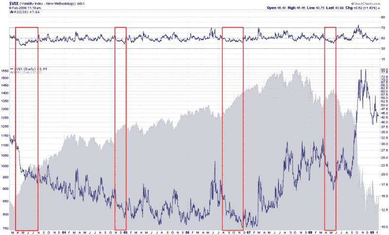
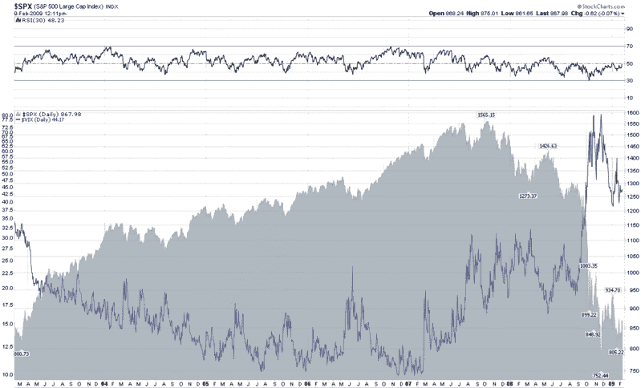

<!--yml

类别：未分类

日期：2024-05-18 18:01:06

-->

# VIX and More: Marty Chenard and the VIX RSI (30) [修订版]

> 来源：[`vixandmore.blogspot.com/2009/02/marty-chenard-and-vix-rsi-30.html#0001-01-01`](http://vixandmore.blogspot.com/2009/02/marty-chenard-and-vix-rsi-30.html#0001-01-01)

对于那些对图表和技术分析感兴趣的人来说，[StockTiming.com](http://www.stocktiming.com/)的 Marty Chenard 拥有优秀的一组图表，他将其作为分析市场的起点。每个交易日他都会有一个[新的免费图表](http://www.stocktiming.com/Stock-Market-Daily-Analysis.htm)，每周一次左右，他设法将 VIX 和波动性纳入谈话中。

不幸的是，对于非订阅者来说，Chenard 的图表每周都会滚动更新，因为它们被新图表所取代，但是[Headline Charts](http://headlinecharts.blog.com/)最近在一篇帖子中捕捉到了 Chenard 的一个 VIX 想法。Headline Charts [维护](http://headlinecharts.blog.com/4561403/)称，根据 Chenard 的说法，市场不仅仅基于 VIX 的下降而 advance，还要求 VIX 的下降发生在 VIX 的 RSI（30）超过 50 线的情况下。

在 Headline Charts 提供的[六个月图表](http://headlinecharts.blog.com/4561403/)中，可以看到，在过去六个月里，VIX 的 RSI（30）超过 50 线的次数非常少？这可能是市场如此难以组织起来一次令人信服的上涨的原因之一吗？

在下面的图表中，我回溯到 2003 年，以更长的视角来探讨 Chenard 的 VIX RSI 理论。不经过任何数字计算，仅凭视觉检查就已经让我对等待 VIX 下降而 RSI 超过 50 的做法表示怀疑。我已经突出显示了四个重大的牛市行情，其中 VIX 下降而 RSI（30）低于 50。

我将对 VIX RSI 理论进行进一步的测试，但乍一看，我很难找到支持 Chenard 的 VIX RSI 市场时机方法的观点。

***[我决定保留原文，但添加了以下评论。]***

感谢[Quantifiable Edges](http://quantifiableedges.blogspot.com/)给我的阅读理解一个推动，并给我一个机会，让我有自己的[Emily Litella](http://en.wikipedia.org/wiki/Emily_Litella)时刻。重新阅读 Headline Charts 的文章后，我现在确信 Chenard 是在谈论 SPX 的 RSI（30）而不是 VIX。这对我来说更有意义，并且在图表上表现得更积极。以下是与上面类似的图表，使用的是 SPX 的 RSI（30）而不是 VIX。现在我更喜欢他的理论了…

[图片：StockCharts](https://www.stockcharts.com/)
